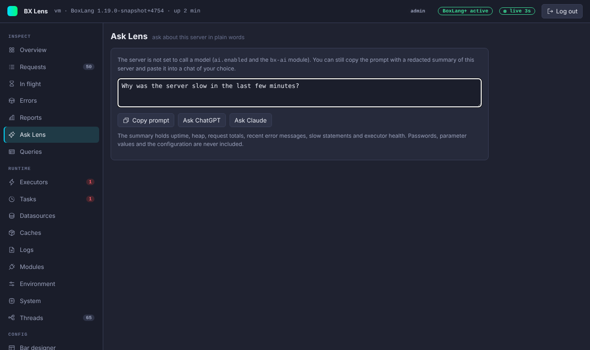

# Ask Lens and AI help

Lens can help you read an error, a failing query or a deadlock, and can answer questions about the server. All of it is optional. Nothing is sent anywhere unless you copy a prompt yourself or an admin turns on `ai.enabled`.



## Three ways to use it

| Way | What happens | Needs |
|---|---|---|
| **Copy prompt** | Lens builds a prompt from redacted data and puts it on your clipboard. You paste it where you like. | Nothing. |
| **Ask ChatGPT** and **Ask Claude** | Lens copies the prompt, then opens `https://chatgpt.com/` or `https://claude.ai/new` in a new tab. You paste the prompt there. The server sends nothing. | Nothing. Turn the buttons off with `ai.links`. |
| **Explain with AI** and **Ask** on the Ask Lens page | The server sends the prompt to a model through the `bx-ai` module and shows the answer. | `ai.enabled`, BoxLang+ or a trial, and an admin. The `bx-ai` module ships inside Lens. |

The buttons appear where they help: on an [error](errors-and-reports.md#errors), on a [statement](in-flight-and-queries.md#queries) and on the [deadlock banner](system-and-threads.md#deadlock) of the Threads page. The Ask Lens page takes a free question of up to 1000 characters.

A viewer can copy a prompt but cannot call the model.

## What a prompt holds

A prompt holds only data that Lens has already redacted, and it is cut at 8000 characters.

- An error prompt holds the type and message, the request line with the redacted query string, the status and time, the stack frames, the SQL statement without values, the last queries and the last messages.
- A query prompt holds the statement with placeholders, the datasource, the run counts and timings, and where it was called from.
- A deadlock prompt holds each thread's name, state, the lock it waits for, who holds it, and up to 14 frames.
- A question prompt holds your question and a short summary of the server: uptime, heap, thread counts, request totals, the slowest URLs, the latest error types and messages, slow or failing statements, the number of running requests and the executor summary.

Passwords, parameter values and the configuration are not in a prompt. Credentials inside URLs and secret-looking `key=value` parameters are removed from the whole text. Exception messages and SQL text are shown as the application produced them, so read a prompt before you paste it into a service you do not control. See the [data flow](../security.md#ai-data-flow).

## Let the server call a model

`bx-ai` is already inside Lens. Set:

```json title="boxlang.json"
{
	"modules": {
		"bxLens": {
			"settings": {
				"ai": {
					"enabled": true,
					"provider": "ollama",
					"model": "llama3.2",
					"apiKey": ""
				}
			}
		}
	}
}
```

| Setting | Meaning |
|---|---|
| `ai.enabled` | The master switch. Off by default. |
| `ai.provider` | A bx-ai provider. Empty uses the bx-ai default. |
| `ai.model` | The model name. Empty uses the provider default. |
| `ai.apiKey` | The API key. Use a `bxsecret:` value. Empty uses the key from the bx-ai settings. |
| `ai.links` | Show Copy prompt and the Ask ChatGPT and Ask Claude buttons. |

A local provider such as Ollama keeps the prompt inside your network. A hosted provider receives it. These settings can only be changed in `boxlang.json`, not from the Settings page.

BoxLang AI (`bx-ai` 3.4.0) ships inside Lens, in the module's `modules` folder, and is Apache 2.0 licensed. If a server removes it, Lens still loads, **Explain with AI** is hidden and the Ask page says the server is not set to call a model. Lens was checked against `bx-ai` 3.4.0 with a mock Ollama server (`harness/mock-ai.py`).

### Limits on the calls

The server runs one AI call at a time, at most 10 per minute, and waits at most 90 seconds for an answer. A call uses a temperature of 0.2. Each call is written to the [audit log](../security.md#audit-log) with its size and provider, not its content. Calls are not blocked by `console.readOnly`, because they change nothing.
