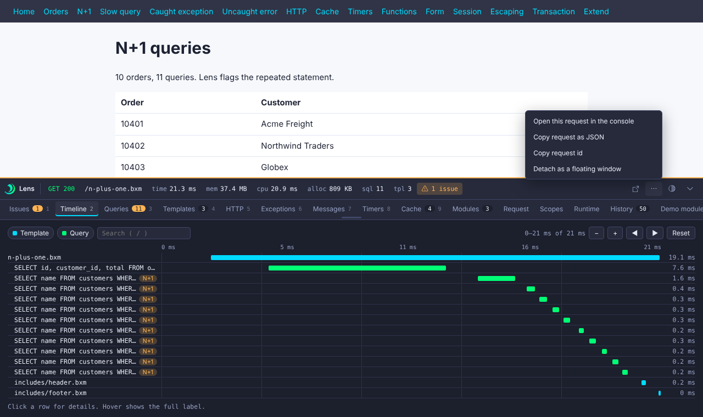

# Bar designer

The Bar designer decides which tabs the bar shows and in what order, for every developer who uses this server.

## Design the bar

- Turn a tab on or off with the eye button.
- Reorder tabs by dragging a row, or with the up and down arrows.
- The preview shows the strip and the tab row as the bar will draw them. The number keys `1` to `9` switch tabs in this order.
- **Save layout** writes the layout. **Reset to default** brings back the built-in order with everything shown.

The list holds the built-in tabs and the panels that modules and apps added. A tab that `tabs.hide` removed is shown as "hidden in settings" and cannot be turned on here.

Developers see a new layout on the next page load. A tab with no data still shows.

## Where it is saved

The layout is a small file, `config/bxlens-layout.json`, in the BoxLang home. It is not a database. If the file is missing or damaged, the default layout applies. If the bar is off (`bar.enabled` is `false`), the designer says so, and the layout applies once you turn the bar on.

## The bar's console links

When the console is on and the caller may use it, the bar has two links into it.

- An **Open console** button in the strip.
- A **More** menu with: open this request in the console, copy the request as JSON, copy the request id, and detach the bar as a floating window.

