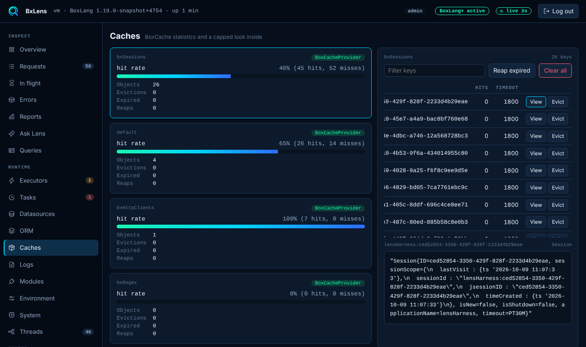

# Caches

The Caches page lists every BoxCache cache with its statistics and a capped view of its keys. The bar does not show caches, because core announces no cache read events. The Runtime tab of the bar lists the cache names.

## Statistics

Each cache has a card with the provider, the hit rate, and the number of objects, hits, misses, evictions, expired objects and reaps. The cache configuration is shown with secret-looking values masked.

## Keys

Pick a cache to list its keys. The list is capped at 100 keys. When the cache holds more, the page says so. Type in **Filter keys** to narrow the list: the filter matches a part of the key and ignores case, and the cap of 100 applies to the matches. Each row shows the number of hits and the timeout of the object when the cache provider reports them.

## View a value

!!! note "BoxLang+"
    Reading a value needs BoxLang+ or a trial. On Free the View button is disabled, the page shows a BoxLang+ note and the server answers 403. Statistics and the key list are free.

**View** shows one cached value as JSON. Lens reads it without touching the statistics. Values are masked by key name with the `redact.keys` list and cut to 2 KB (2048 characters), and the page says when a value was cut. Only admins can view a value, and each view is written to the [audit log](../security.md#audit-log) with the cache name and the key.

## Evict, reap and clear

These need BoxLang+ or a trial. On Free the buttons are disabled and the server answers 403.

| Action | What it does |
|---|---|
| **Evict** | Removes one key. |
| **Reap expired** | Runs the cache's reap now. |
| **Clear all** | Removes every object from the cache after a confirmation. |

These actions are for admins, are written to the audit log, and are refused when `console.readOnly` is on.

!!! note "A viewer sees key names"
    A viewer can see the statistics and the key names but not the values. Key names can still reveal ids or e-mail addresses. Give out the viewer password with that in mind.

## Settings

Turn the page off with `collectors.caches.enabled` or `tabs.hide`.
