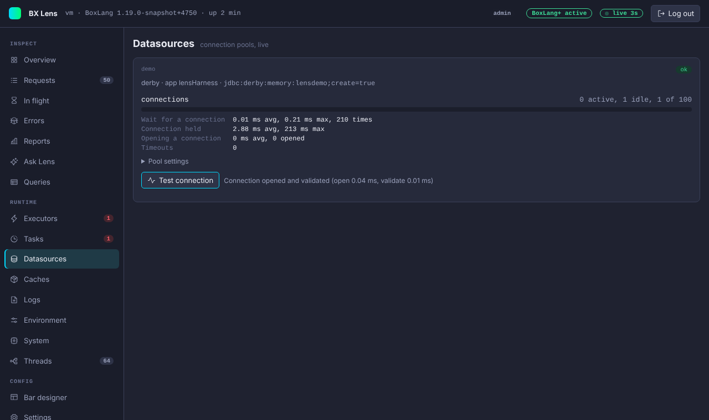

# Datasources

The Datasources page shows every datasource the runtime knows, with the state of its connection pool. It updates live.

## The cards

Each datasource has a card with a state pill, the driver, the application it belongs to (if any), whether it was created on the fly, and the JDBC URL. The URL is shown without user info and without secret-looking parameters such as `password` or `token`.

| State | Meaning |
|---|---|
| `ok` | The pool has room. |
| `waiting` | At least one thread is waiting for a connection. |
| `saturated` | Every connection of the pool is in use. |
| `timeouts` | A caller gave up waiting for a connection since Lens began to measure. |
| `idle` | The pool has not started. It starts on the first query. |

For a running pool the card shows:

- **Connections**: active, idle, total and the pool maximum, with a bar that turns amber at 70 percent use and red at 90. It also shows how many threads wait for a connection.
- **Timings**: how long callers wait for a connection, how long a connection is held, how long it takes to open one, and the number of timeouts. Averages and maximums are given.
- **Pool settings**: minimum idle and maximum size, connection, idle and validation timeouts, maximum lifetime, keepalive, leak detection, auto commit, read only, isolation level and the database user.

## Where the timings come from

BoxLang's pools are Hikari pools. Lens attaches a small metrics tracker to each started pool that has none (a few counters, no histograms). It checks for new pools every few seconds and when you open the page. Timings count from the moment the tracker is attached, so they start at zero after a restart.

If a pool already has its own metrics tracker, for example one you added, Lens leaves it alone. The card then says that timings are not collected.

## Test connection

**Test connection** opens a connection, checks it with a 5 second validation, closes it, and shows the time to open, the time to validate and the database product and version. A failure shows the exception class and message.

The test is for admins. A viewer sees the button disabled. It still works when `console.readOnly` is on, because it changes nothing. Each test is written to the [audit log](../security.md#audit-log).

## Settings

Turn the page off with `collectors.datasources.enabled` or `tabs.hide`. See [Configuration](../configuration.md#collectors).
