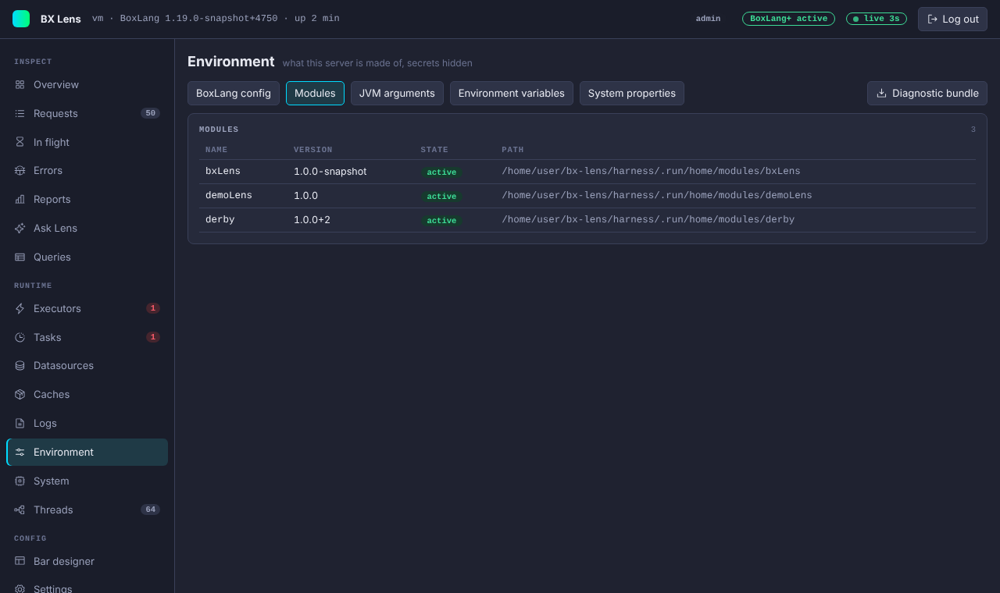

# Environment

The Environment page shows what this server is made of: the effective BoxLang configuration, the loaded modules, the JVM arguments, the environment variables and the system properties.

## Sections

| Section | Content |
|---|---|
| Effective configuration | `boxlang.json` merged with the defaults and the environment, as BoxLang sees it. Long lists are cut at 200 entries and values at 500 characters. |
| Modules | Name, version, state and path of every module. |
| JVM arguments | The flags the JVM started with. |
| Environment variables | Every variable, with a filter by name. |
| System properties | Every Java system property, with a filter by name. |

## How secrets are hidden

Lens hides a value when its name looks secret. The check looks for parts such as `pass`, `pwd`, `secret`, `token`, `api key`, `access key`, `private`, `credential`, `auth`, `cookie`, `session`, `salt`, `seed`, `signature`, `dsn`, `connection string`, `bearer` and `jwt`. It also removes the user info from URLs, hides secret-looking URL parameters, and shows an encrypted `bxsecret:` value as `[encrypted]`. The check errs on the side of hiding.

It works by name. A secret stored under a name that does not look like one, for example in a variable called `X1`, is shown. Look at the page before you share a screenshot or a bundle.

## Diagnostic bundle

**Diagnostic bundle** needs BoxLang+ or a trial. On Free the link is disabled with a Plus chip and the server answers 403. It downloads one zip file named `lens-diagnostics-{timestamp}.zip` to attach to a support ticket. It holds:

| File | Content |
|---|---|
| `README.txt` | The time, the Lens version and a note about what is left out. |
| `thread-dump.txt` | A thread dump taken when you download. |
| `environment.json` | The data of this page. |
| `system.json` | The data of the [System](system-and-threads.md) page. |
| `executors.json`, `tasks.json` | Executors and scheduled tasks. |
| `datasources.json` | Datasources and pool numbers. |
| `caches.json` | Caches and their statistics, without keys or values. |
| `lens-settings.json` | The effective Lens settings. Passwords and API keys show only `set` or `not set`. |

The bundle holds no request data and no log files. It is for admins, and each download is written to the [audit log](../security.md#audit-log).

## Settings

Turn the page off with `collectors.environment.enabled` or `tabs.hide`. The download route of the bundle is not tied to these switches: an admin who knows the URL (`/~bxlens/index.bxm/api/bundle`) can still download it.
