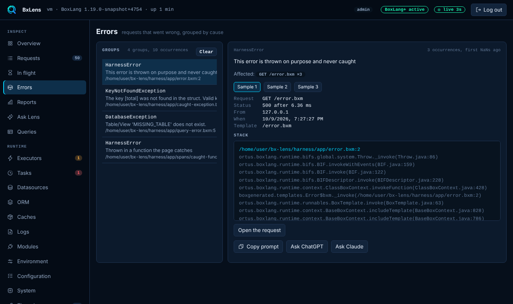
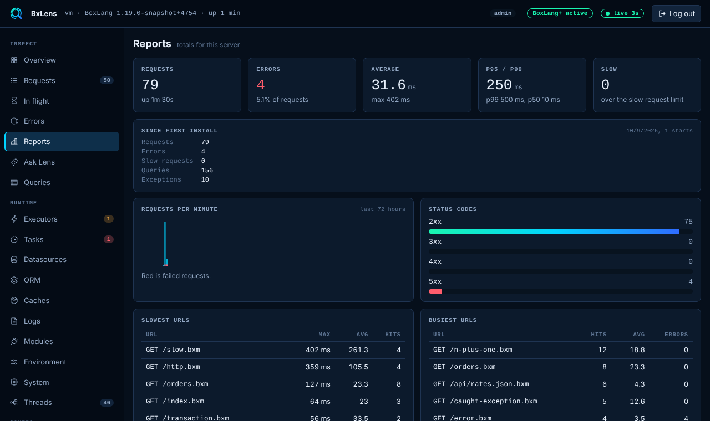

# Errors and Reports

Both pages work across all requests that Lens tracks. With the console on, that is every request. Without BoxLang+ or a trial they are kept in memory only and a restart clears them. With one of those, Lens saves them to disk. See [Licensing](../licensing.md#free-and-boxlang).

## Errors

The Errors page groups requests that went wrong by cause, so a thousand failures of one bug are one row.

### What counts as an error

Every exception that the request collected is filed: uncaught ones, and ones your code caught and reported to Lens. A response with status 500 or higher and no exception is filed as an `HTTP 500` group. The row says `handled` when the code caught the error.

### How errors are grouped

Two errors are the same group when they have the same type, the same message after numbers, ids (UUIDs) and quoted values are removed and the text is lowercased, and the same top three stack frames (file and line). When there are no frames, the request path is used. The group id is a short hash of that.

A row shows the type, the message, the count, when it was first and last seen, and the most affected URLs.

### Samples

Each group keeps its five newest samples. A sample holds:

- the time, the request id, the method, the path and the status
- the query string, with the values of secret-looking parameters hidden
- the client address, the server that handled it (host, address and id), user agent, application, template and duration
- the message and detail
- the BoxLang frames and the Java frames (no Java frames at `collect.level` `light`)
- the SQL statement, for a database error, without parameter values
- the last three queries the request ran, and the last five messages it sent to Lens

Pick a sample to read it. **Open the request** jumps to the request on the Requests page when it is still in memory. For AI help on an error, see [Ask Lens and AI help](ask-lens-and-ai.md).

Exception messages are stored as the application produced them, cut to length. If your code puts personal data into an error message, it is in the sample.

### Limits

Lens keeps up to 200 groups. The group seen least recently is dropped first. **Clear** removes all groups. It is for admins, is written to the audit log and is refused when `console.readOnly` is on.

Turn the page off with `collectors.errors.enabled` or `tabs.hide`.

## Reports

The Reports page gives totals and trends for the whole server.

### What it shows

| Block | Content |
|---|---|
| Totals | Requests, errors, average time, p95 and p99, and the number of slow requests (at or over `thresholds.slowRequestMs`). |
| Since first install | Requests, errors, slow requests, queries and exceptions since Lens was first installed on this server, plus the number of runs. Shown only with the disk store (BoxLang+). |
| Requests per minute | A minute by minute series of requests and failed requests. 60 minutes on Free. |
| Status codes | Counts for 1xx up to 5xx. |
| Slowest, busiest and most failing URLs | The top ten for each, by longest time, hits and errors. |
| Work done | Queries, outgoing HTTP calls and exceptions. |

A request counts as failed when its status is 500 or higher or it ended with an uncaught exception.

### Percentiles

Lens does not keep every duration. It counts requests in buckets: 5, 10, 25, 50, 100, 250, 500, 1000, 2500, 5000 and 10000 ms, and one above. A percentile is the upper edge of the bucket it falls in. A p95 of 250 means that 95 percent of requests took 250 ms or less. Above 10000 ms, the longest time seen is shown.

### Memory and history

The totals and the URL lists are in memory. A URL is `METHOD path` without the query string. Lens keeps up to 300 URLs and drops the one seen least recently. The minute series covers the last 60 minutes on Free, or `store.retentionHours` with the disk store (BoxLang+). With the disk store the totals since first install survive restarts and upgrades.

**Reset the counters** clears the totals, the URL lists and the minute series of this run. It is for admins, is written to the audit log and is refused when `console.readOnly` is on.

The page header names the server the totals belong to (host, address and id). The same `server` is in the result of `lensReport()`.

Turn the page off with `collectors.reports.enabled` or `tabs.hide`.

## The disk store

The disk store needs BoxLang+ or a trial. On Free, both pages show a note that the data is kept in memory only. With a license, Lens writes `errors.json` and `reports.json` to `store.dir` (default `lens-data` in the BoxLang home) every `store.flushSeconds`, and when the module stops. Each file is written to a temporary file and renamed, so a crash cannot leave half a file. Errors older than `store.retentionHours` are dropped. When `errors.json` would be bigger than `store.maxMB`, the older half of the groups is dropped. In a container, put `store.dir` on a mounted volume. See [Running Lens in production](../guides/production.md).

Both files carry the identity of the server that wrote them in a top level `server` object, and every error group and sample has its own `serverId`, so files from many servers can be merged without losing where a record came from. `errors.json` is `{ "server": {...}, "groups": [...] }`. Older files, a plain list of groups, are still read.

The files hold redacted data, but they are still data from your server. Give the folder the permissions you give to your logs.
