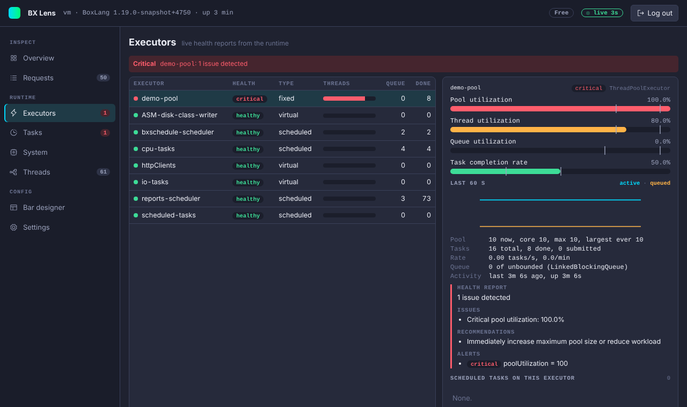

# Executors

The Executors page shows every executor registered in the runtime's async service, with the numbers and the health report that BoxLang itself computes for each one. It updates live.

## The list

Each row shows the executor name, a health pill (`healthy`, `degraded`, `critical`, or a state such as `draining` or `shutdown`), its type, a thread bar, queue size and completed tasks. Rows are sorted by health, worst first, then by name. The Overview and the page badge count executors that are degraded or critical.

## The detail

Pick an executor to see:

- **Meters** for pool, thread, queue utilization and task completion rate. Each meter marks the degraded and critical thresholds on its track. The thresholds come from the executor itself, and the console falls back to 75 and 95 percent for pool and thread use, 70 and 95 for the queue, and 50 and 25 for the completion rate when it gives none.
- **Last 60 s**: a chart of active threads and queued tasks.
- **Numbers**: pool size (now, core, max, largest ever), task counts, tasks per second and per minute, queue type and capacity, time since the last activity, uptime.
- **Health report**: the summary, issues, recommendations, alerts and insights from BoxLang's `healthReport`.
- **Scheduled tasks on this executor**: the tasks of every scheduler bound to it, with their status. Click one to open it in [Tasks](tasks.md).

!!! note
    The 60 second chart is built in your browser while the page is open. It starts empty when you open the console.

## Try it

The harness has a two-thread `demo-pool` and a page that fills it. Open `/load.bxm` in the harness app, then watch the pool go degraded and critical. See [Development](../project/contributing.md#the-harness).
