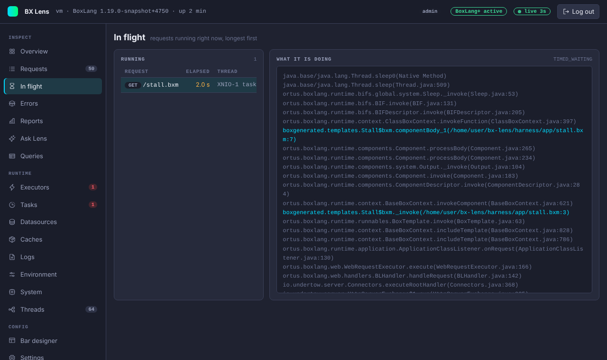
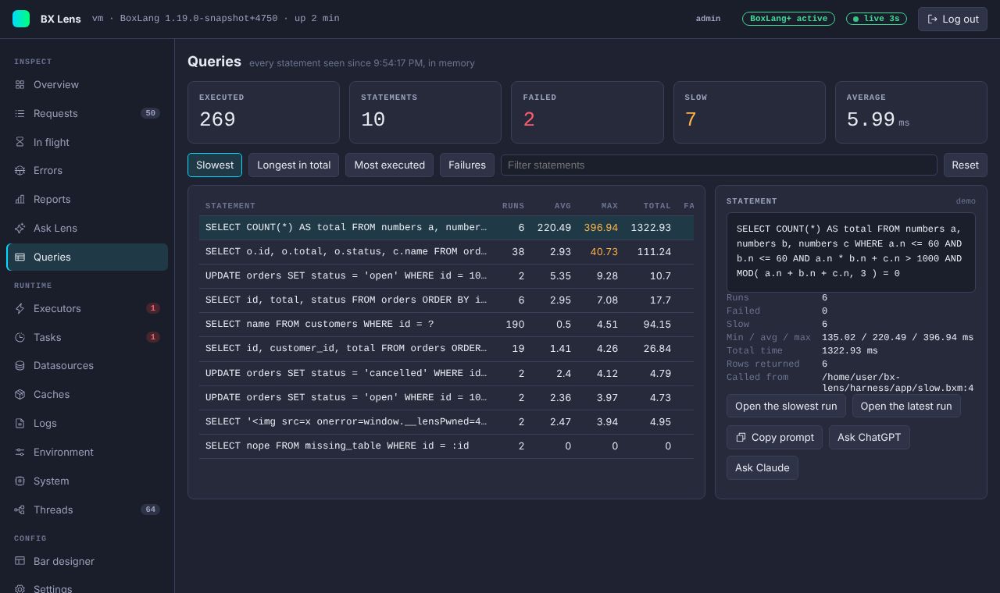

# In flight and Queries

## In flight

The In flight page lists the requests that are running right now, longest first. Use it when the server feels stuck and you want to know what it is doing.

Each row shows the request (method and path), how long it has run, the name of its thread and how many queries it has run so far. A time over one second turns amber. The list updates live.

Pick a row to see **what it is doing**: the stack of the request's thread at that moment, up to 80 frames, with BoxLang frames highlighted. If the request finished in the meantime, the page says so.

The page lists requests that Lens tracks. When the console is on, that is every request except the console's own and the paths in `excludePaths`.

Turn the page off with `collectors.inflight.enabled` or `tabs.hide`.

## Queries

The Queries page ranks the SQL statements the server has run since it started (or since the last reset). Use the bar's [Queries panel](../panels/queries.md) to look at one request. This page looks across all requests.

### One row per statement

A statement is counted with its placeholders, so `SELECT * FROM customers WHERE id = ?` with a thousand different ids is one row with a thousand runs. Lens keeps the statement text and the numbers only, never parameter values. White space is ignored when statements are compared, and the datasource is part of the key.

| Column | Meaning |
|---|---|
| Runs | How many times it ran, failures included. |
| Avg, Max | Average and longest time in milliseconds. The average counts the runs that did not fail. |
| Total | Time spent in this statement, all runs added. |
| Failed | How many runs failed. |

The tiles at the top show the number of executed queries, distinct statements, failures, slow runs and the average time. A run is slow when it takes at least `thresholds.slowQueryMs`.

Sort with **Slowest**, **Longest in total**, **Most executed** or **Failures**, and narrow the list with **Filter statements**.

### The detail

Pick a statement to see its datasource, runs, failures and slow runs, the minimum, average and maximum time, the total time, the rows returned, where it was called from (template and line, when Lens could find it) and the last error. **Open the slowest run** and **Open the latest run** jump to those requests on the [Requests](index.md#requests) page, as long as they are still in memory. For AI help on a statement, see [Ask Lens and AI help](ask-lens-and-ai.md).

### How failures are counted

BoxLang announces no event when a query fails, so Lens uses two signs:

- A query that started and never finished is counted as a failure of that statement.
- A database exception that reached the request, with the SQL attached, is counted as a failure of that statement.

A statement that fails to prepare, for example one with an unknown table or bad syntax, never starts a query. It shows up here only when its error reaches the request. If your code catches the error, the failure is not counted. A failed run is listed as its own row, because Lens does not know the datasource of a run that did not finish.

### Limits

Lens keeps up to 500 statements. When it is full, the statement seen least recently is dropped. The statistics are in memory, are cleared by a restart, and are not saved by the Plus disk store. **Reset** clears them. It is for admins, is written to the audit log and is refused when `console.readOnly` is on.

The page and the bar's query collector share one switch, `collectors.queries.enabled`. With the collector off, the page is gone.
