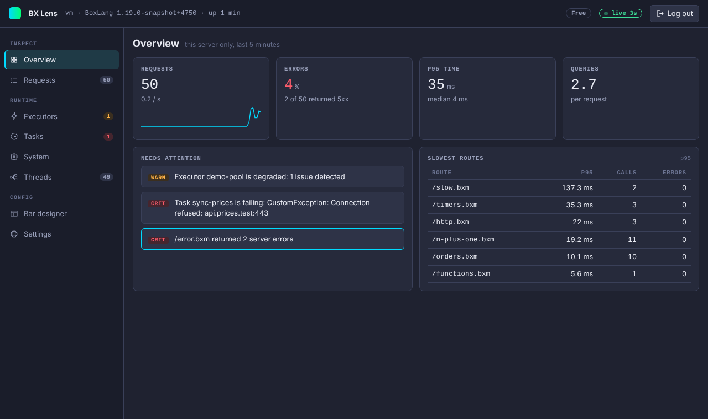
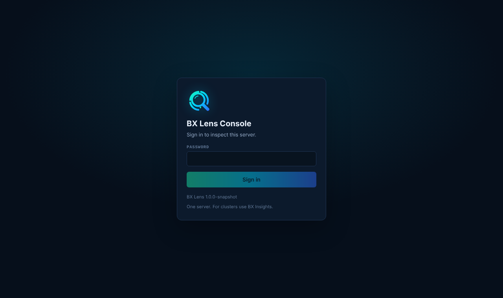
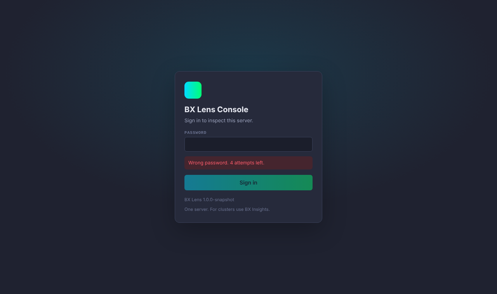
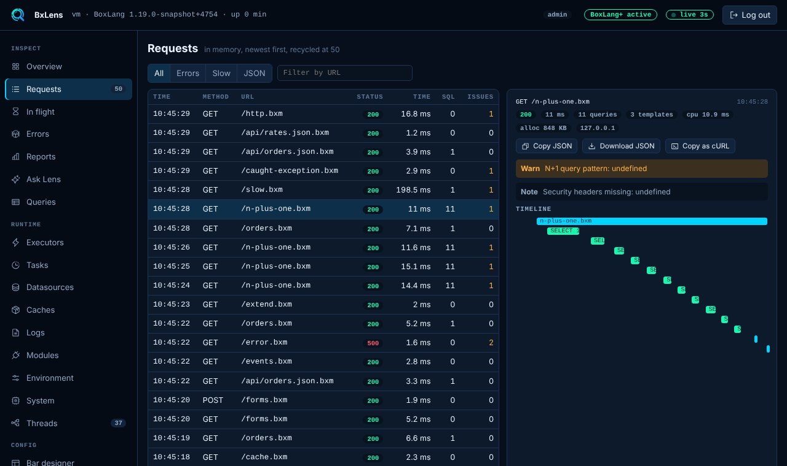

# Console

The console is a standalone page for one server. It shows live requests, executor health, scheduled tasks, datasources, caches, logs, errors, query statistics, JVM numbers and threads. It lets you design the bar and change many settings without a restart. It is off by default.



## Turn it on

```json title="boxlang.json"
{
	"modules": {
		"bxLens": {
			"settings": {
				"console": {
					"enabled": true,
					"password": "bxsecret:AbCdEf123...==",
					"access": "local"
				}
			}
		}
	}
}
```

Restart the runtime. The console needs `console.enabled` and a password. If the password is empty or cannot be decrypted, Lens logs an error and an allowed caller sees a setup page (HTTP 503) instead of a login.

### Make the password

Store the password as an encrypted `bxsecret:` value. BoxLang decrypts any config value with that prefix at load time, using the runtime's secret seed (BoxLang 1.17 or newer).

```bash
boxlang generatesecret "a long random password"
# bxsecret:AbCdEf123...==
```

Paste the result into `console.password`. Use the same seed on every machine that shares the config. A plain text password also works but is a bad idea in a file you commit.

## Open it

The console lives at:

```text
/~bxlens/index.bxm
```

This is a public mapping named `~bxlens`, the same pattern as `/~bxai` in bx-ai. `/~bxlens/index.bxm` always works. `/~bxlens/` with a trailing slash is rewritten to it, but on MiniServer that also needs a pass predicate, see [The console URL](../guides/production.md#the-console-url). Every other route is under it, for example `/~bxlens/index.bxm/stream`.

## Sign in



There are no user names. The password you type decides the role:

| Role | Password | Can do |
|---|---|---|
| Admin | `console.password` | Everything the console offers. |
| Viewer | `console.viewerPassword` (optional) | Look at every page. Cannot change anything, and cannot download thread dumps, log files, heap dumps or the diagnostic bundle, or read cache values. |

The role shows in the header. See [Roles](../security.md#roles) for the full list.

A wrong password says so and counts the attempt. After `console.maxLoginAttempts` wrong tries the address is locked out for `console.lockoutMinutes`.



Sessions live in memory. They end after `console.sessionMinutes` idle, 12 hours after login at the latest, or at a restart.

When someone reaches the console over plain HTTP from a non-loopback address, every page shows a warning banner. Set `console.requireHttps` to refuse such requests.

## Pages

| Page | What it is for |
|---|---|
| Overview | Requests per second, error rate, p95 and median time, queries per request, slowest routes and what needs attention. |
| Requests | Every request in memory (25 on Free), with detail. See below. |
| [In flight](in-flight-and-queries.md#in-flight) | Requests running right now, with a live stack. |
| [Errors](errors-and-reports.md#errors) | Errors grouped by cause, with samples. In memory on Free. |
| [Reports](errors-and-reports.md#reports) | Totals, percentiles, status codes, URLs and a minute by minute series. |
| [Ask Lens](ask-lens-and-ai.md) | Questions about the server, and prompts for a model. With BoxLang+ it is the full page of the [ops assistant](ai.md). |
| [Queries](in-flight-and-queries.md#queries) | Statistics for every SQL statement. |
| [Executors](executors.md) | Live health of every executor. |
| [Tasks](tasks.md) | Schedulers and scheduled tasks. Run now, pause, resume and reload need BoxLang+. |
| [Datasources](datasources.md) | Connection pools with live numbers and a connection test. |
| [Caches](caches.md) | Cache statistics and a capped key list. Reading a value, evict, reap and clear need BoxLang+. |
| [Logs](logs.md) | Every log file, with search, a level filter and a live tail. Download needs BoxLang+. |
| [Environment](environment.md) | Configuration, modules, JVM arguments, variables. The diagnostic bundle needs BoxLang+. |
| [Modules](modules.md) | Every loaded module, nested ones too, with version, state, path and what it provides. |
| [System](system-and-threads.md) | CPU, memory, garbage collection, Run GC, classes, disks and runtime details. A heap dump needs BoxLang+. |
| [Threads](system-and-threads.md#threads) | Thread viewer, thread dump and deadlock detail. |
| [Bar designer](bar-designer.md) | Choose and order the tabs of the bar. Saving a layout needs BoxLang+. |
| [AI](ai.md) | Status, settings and a connection test for the ops assistant. Admin only. BoxLang+ to change anything. |
| [Settings](settings.md) | The effective settings, editable by an admin. |

Hide a page with `tabs.hide`, or turn its collector off. Settings is always there.

Most of the console is free. The items marked BoxLang+ need a license or trial, and on Free they show a "BoxLang+" note and the server answers 403. See [Licensing](../licensing.md#free-and-boxlang).

### Requests

The list shows time, method, URL, status, duration, SQL count and issue count, newest first. A Server column is added when the history holds requests of more than one server id (for example after the id was changed), and the detail always names the server that handled the request. Filter by All, Errors, Slow or JSON, or by URL text. Pick a row to see the detail: status, timings, issues, the slow request sample if there is one, and a timeline waterfall.



From the detail you can copy the request as JSON, download it as a JSON file, or copy it as a cURL command (redacted headers are left out). Each request has a deep link, `/~bxlens/index.bxm#requests/{id}`, which the bar's More menu uses. History is an in-memory ring buffer of `history.maxRequests` (default 50). A request that was recycled shows "That request has been recycled".

The console never lists its own requests.

## Live data

One Server-Sent Events stream per browser (`GET /~bxlens/index.bxm/stream`) pushes the data of the open page once a second: requests, executors, tasks, datasources, in-flight requests, queries, system numbers and new log lines. A newer stream from the same session replaces the older one, and a stream ends after five minutes and the browser reconnects by itself. The header shows `live 3s` or `paused`. If the stream is unavailable (no `EventSource`, or `console.maxStreams` is reached), the page polls every 3 seconds instead. Threads refresh every 5 seconds while open, because a thread dump briefly pauses the JVM.

## Security model

The console is built for a hostile network, within reason.

- Callers outside `console.access`, `access.allowedHosts` or `access.requireHeader` get a plain 404.
- Strict Content-Security-Policy and no request to any other site. Alpine.js and the Phosphor icons are vendored and fonts are system fonts, so it works air gapped.
- HttpOnly, SameSite=Strict session cookie (Secure on HTTPS), a CSRF header on every state change, and a custom header on login.
- Per-address lockout, and two roles: a viewer can look but not change or download.
- Optional HTTPS requirement, and an audit log of logins and changes.

Read the full list in [Security](../security.md#console-protection), and use [Running Lens in production](../guides/production.md) before you expose it.

## What the console is not

It is for ONE server. It keeps the last `history.maxRequests` requests in memory (25 on Free, see [Licensing](../licensing.md#free-and-boxlang)). Errors, reports and query statistics are in memory too. With BoxLang+ or a trial, errors and reports are also saved to disk so they survive restarts. Apart from that, Lens writes only the saved bar layout, the saved settings changes and the audit log. For clusters, history over time and alerting, use the separate BX Insights product. See [Roadmap](../project/roadmap.md#relation-to-bx-insights).
