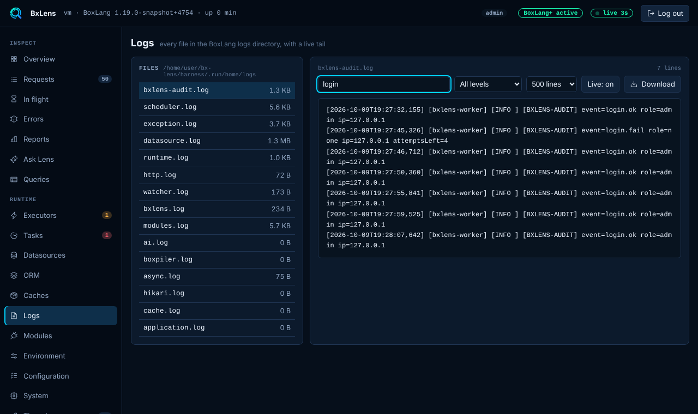

# Logs

The Logs page shows every file in the BoxLang logs directory. You can read the end of a file, search it, filter by level, follow new lines live. Downloading the file needs BoxLang+.

## The file list

The list holds every regular file in the logs directory and one level of folders below it, newest first, with the size of each file. The Lens [audit log](../security.md#audit-log), `bxlens-audit.log`, is in the same directory and appears here.

## Reading a file

Pick a file to see its last lines. Choose 200, 500, 1000 or 2000 lines.

- **Search** keeps the lines that contain the text, ignoring case.
- **Level** keeps lines at the chosen level and above: DEBUG and up, INFO and up, WARN and up, or ERROR only. Lens reads the level from the `[LEVEL]` marker in the line. A line without a marker, such as a line of a stack trace, follows the level of the line before it.
- Lens reads at most the last 8 MB of a file, or the last 64 MB when you search or filter. The page says when older lines are not shown. A line is cut at 4000 characters.

## Live tail

**Live: on** appends new lines as they are written. The tail starts at the end of the file and uses the console's live stream, once a second. If the file shrinks, for example after a rotation, the tail starts again from the top of the file. **Live: paused** stops it.

## Download

**Download** saves the whole file. It needs BoxLang+ or a trial, is for admins and is written to the audit log. On Free the button is disabled with a Plus chip and the server answers 403. Browsing, search, the level filter and the live tail are free.

## Path checks

A file is chosen from the list by name. Lens resolves the name inside the logs directory, follows symbolic links, and answers 404 for anything that is not a regular file inside that directory. A name such as `../../etc/passwd` or an absolute path is refused.

!!! warning "Logs are not redacted"
    Lens shows log lines as written. If your application logs a password or a personal detail, it is visible here, to viewers as well. Only the download needs the admin role and BoxLang+. See [Security](../security.md#roles).

## Settings

Turn the page off with `collectors.logfiles.enabled` or `tabs.hide`. This is not the `logs` collector, which sends the log messages of one request to the bar's Messages panel.
