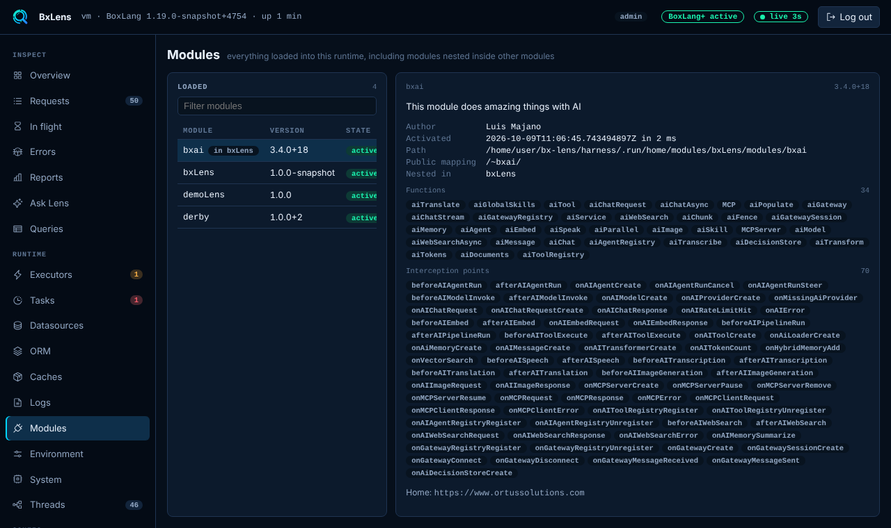

# Modules

The Modules page lists every module loaded into the runtime, including modules nested inside other modules. Use it to check what is installed, which version runs and whether a module activated.

## The list

The left side has one row per module, sorted by name, with a filter box. Each row shows the name, the version and the state:

| State | Meaning |
|---|---|
| active | The module activated. |
| loaded | The module is registered but did not activate. |
| disabled | The module is turned off. |

A module that sits inside another one shows `in <parent>` next to its name. The bx-ai module that ships inside Lens is an example.

## The detail

Pick a row to see:

- The description and the home URL.
- The author, and when the module activated and how long it took.
- The path on disk.
- The public mapping, if the module has one.
- The parent module for a nested module, and the nested modules for a parent.
- The modules it depends on.
- What it provides: functions (BIFs), components, member methods, interceptors and custom interception points. Each list shows up to 80 names.

!!! note
    A module that core registers through the Java service loader, like Lens itself, may show empty function lists.

## Settings

The page uses the `modules` collector, the same one as the bar's [Modules panel](../panels/modules.md). Turn both off with `collectors.modules.enabled`, or hide the page with `tabs.hide`. The [Environment](environment.md) page has a shorter list of modules with name, version, state and path.
