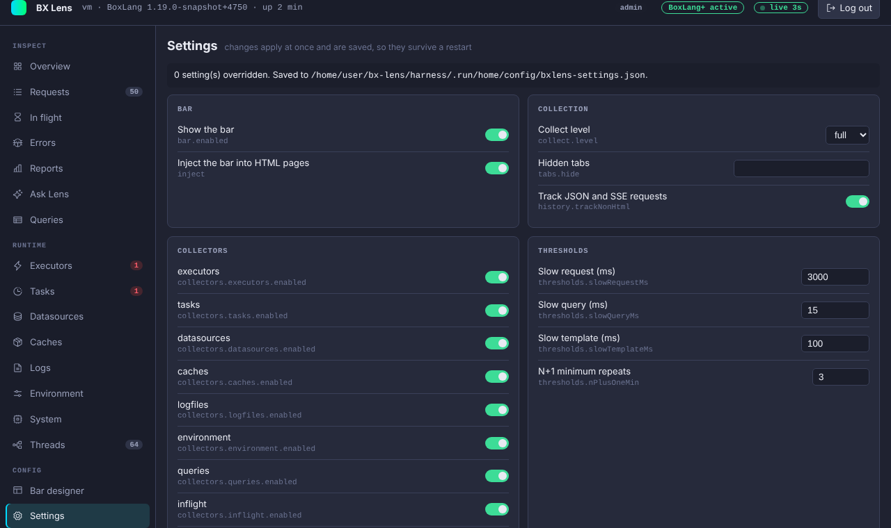
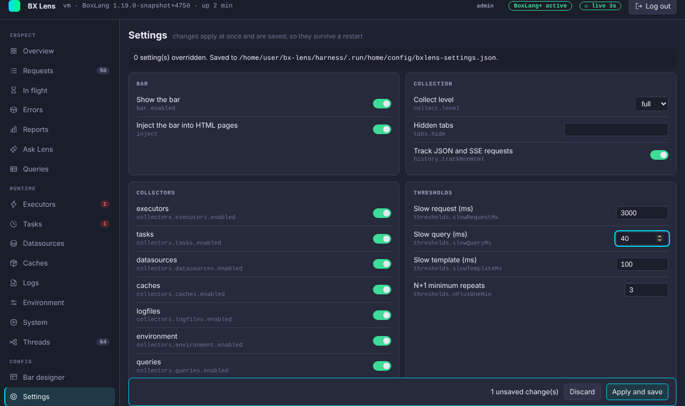

# Settings

The Settings page shows the values Lens is running with and lets an admin change many of them without a restart.

## Change a setting

Settings are grouped: Bar, Collection, Collectors, Thresholds, Checks, Interface, Limits, Editor, Console and Access. A switch, a list or a field sits next to each live setting.

1. Change one or more values. The bar at the bottom counts the unsaved changes.
2. Press **Apply and save**. Press **Discard** to drop them.

The change applies at once. For example, turning a collector off removes it for the next request, and a new slow query threshold counts from now on. Lens also saves the change to `config/bxlens-settings.json` in the BoxLang home, or to the file in `console.overridesFile`, so it survives a restart.

A value that is not valid, for example a number out of range, is refused with a message and nothing is saved. Lens checks every value again when it loads the file, so a file edited by hand cannot switch on something the console may not change. Invalid entries are skipped and a warning is logged.

## Saved changes win over boxlang.json

A setting that has a saved change is marked **changed**. Its tooltip shows the value from `boxlang.json`. **Reset** next to it removes the saved change and goes back to the `boxlang.json` value. **Reset all to defaults** removes every saved change. The page shows how many settings are overridden and where the file is.

The file is a flat map of dotted keys, for example `thresholds.slowQueryMs`. It holds no secrets, because no password or key can be changed here.

If you change a value in `boxlang.json` that also has a saved change, the saved change keeps winning until you reset it.

## Which settings are live

The settings marked **boxlang.json only** are shown with their value but cannot be changed from the console. That list includes the passwords (shown only as `set` or `not set`), who can reach the console and the bar, `console.readOnly`, `console.allowHeapDump`, `console.requireHttps`, the proxy settings, the disk store, the AI settings and `history.maxRequests`. Everything else on the page is live. The full list is in [Configuration](../configuration.md#live-settings).

## View only

Two things make the page read only.

- **Viewer role.** A viewer who signed in with `console.viewerPassword` sees a notice, and every field is disabled. See [Roles](../security.md#roles).
- **`console.readOnly`.** When it is `true`, nobody can change anything from the console, not even an admin. The same switch stops task actions, the bar layout, cache actions, resets and Run GC. It can only be set in `boxlang.json`. Heap dumps have their own switch.

Every change and reset is written to the [audit log](../security.md#audit-log) with the keys and the new values.

## The license

The header of every console page shows the license state (BoxLang+ active, Trial, License expired or Free), and your role. See [Licensing](../licensing.md).
