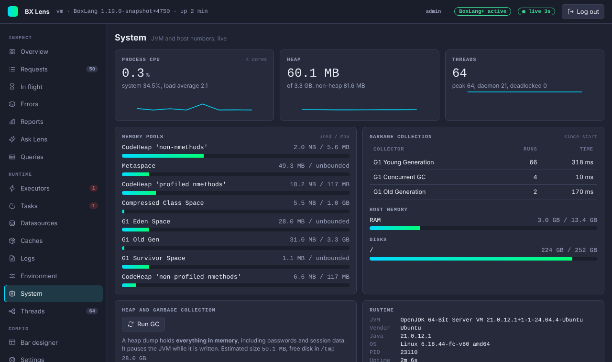
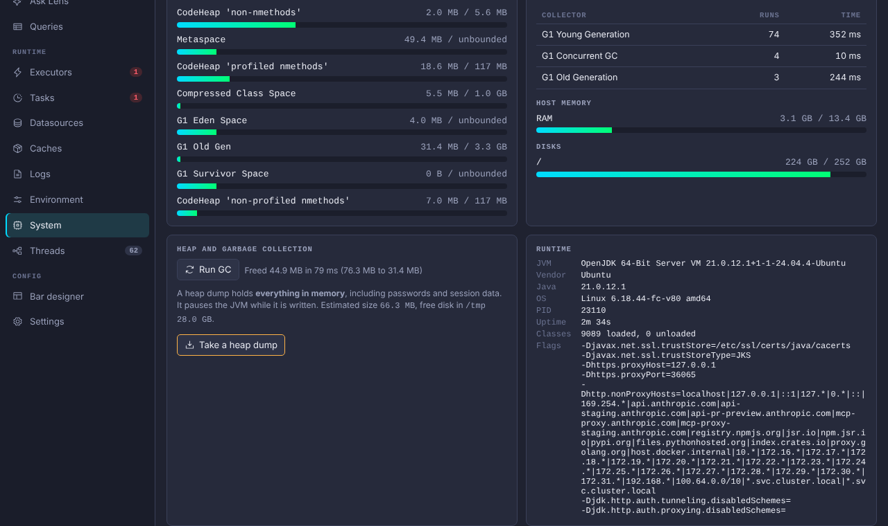
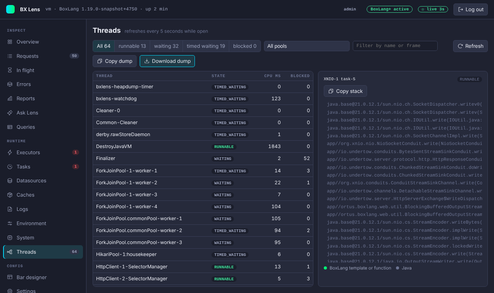

# System and Threads

## System

The System page shows JVM and host numbers from the JDK management beans. It updates live and keeps a short chart of CPU, heap and thread count while you watch.

| Block | Content |
|---|---|
| CPU | Process CPU and system CPU in percent, core count, load average, OS and architecture. |
| Heap | Used and maximum heap, plus non-heap. |
| Threads | Live, peak and daemon threads, and deadlocked threads. |
| Memory pools | Each pool with used and maximum. |
| Garbage collection | Runs and total time per collector since start. |
| Host memory | RAM and swap use, when the JVM can report them. |
| Disks | Total and used space per file system root. |
| Runtime | VM, vendor, Java version, PID, uptime, loaded classes and the JVM flags. Flags that look sensitive are masked. |
| System properties | A selected, fixed list (OS, time zone, encoding, Java home and similar). It is not a full dump. |

### Run GC and heap dumps

The **Heap and garbage collection** card is for admins. A viewer does not see its buttons.

**Run GC** asks the JVM to run a garbage collection and shows the heap used before and after, the memory freed and the time it took. The JVM may pause briefly. The JVM can ignore the request if it runs with `-XX:+DisableExplicitGC`. Run GC is refused when `console.readOnly` is on.

**Take a heap dump** writes a `.hprof` file that you can open in a tool such as Eclipse MAT or VisualVM. It is off by default. Set `console.allowHeapDump` to `true` in `boxlang.json` to turn it on.

!!! danger "A heap dump holds everything in memory"
    The file contains passwords, session data, keys and personal data that were in memory. Lens cannot redact it. Turn the option on only when you need it, download the file over HTTPS, and handle it like a database backup. See [Security](../security.md#heap-dumps).

How it works:

- The page shows the estimated size and the free disk space, and asks for a confirmation. The JVM pauses while the file is written.
- Lens needs free space in the temporary folder (`java.io.tmpdir`) of at least 1.2 times the heap in use. If there is less, it refuses to start.
- It writes live objects only. A full garbage collection runs first, which also keeps the file smaller.
- One dump at a time. While one is running or waiting for download, a new one is refused.
- The file lives in a private temporary folder. Download it with **Download .hprof**, or press **Discard**.
- Lens deletes the file 5 minutes after you download it, or 10 minutes after it was written if nobody downloads it. It also deletes it when the module stops.
- `console.readOnly` does not block heap dumps. They have their own switch, `console.allowHeapDump`. A viewer cannot start or download one.
- Every start, refusal, download and discard is written to the [audit log](../security.md#audit-log).

## Threads

The Threads page lists every JVM thread with its state, CPU time and blocked time. It refreshes every 5 seconds while open, not through the live stream, because taking a thread dump pauses the JVM briefly.

- Filter by state (runnable, waiting, timed waiting, blocked), by pool, or by name or frame.
- Threads running BoxLang templates or functions are marked **BoxLang**, and the thread that serves your own call is marked **this request**.
- Pick a thread to see its stack. BoxLang frames are highlighted, and a waiting thread shows the lock and its owner. Copy the stack with one click.
- **Copy dump** puts a jstack-style dump on the clipboard. **Download dump** saves it as `lens-thread-dump-{timestamp}.txt`. Download is for admins and is written to the audit log. A viewer cannot download it.

## Deadlock

When the JVM reports a deadlock, the Threads page shows a red banner with the number of threads involved. Under it, each deadlocked thread is listed with the lock it waits for and the thread that holds that lock, which shows the cycle. The banner has the same prompt buttons as an error, see [Ask Lens and AI help](ask-lens-and-ai.md). The System page counts deadlocked threads too.

Turn either page off with `collectors.system.enabled` or `collectors.threads.enabled` (or `tabs.hide`).
