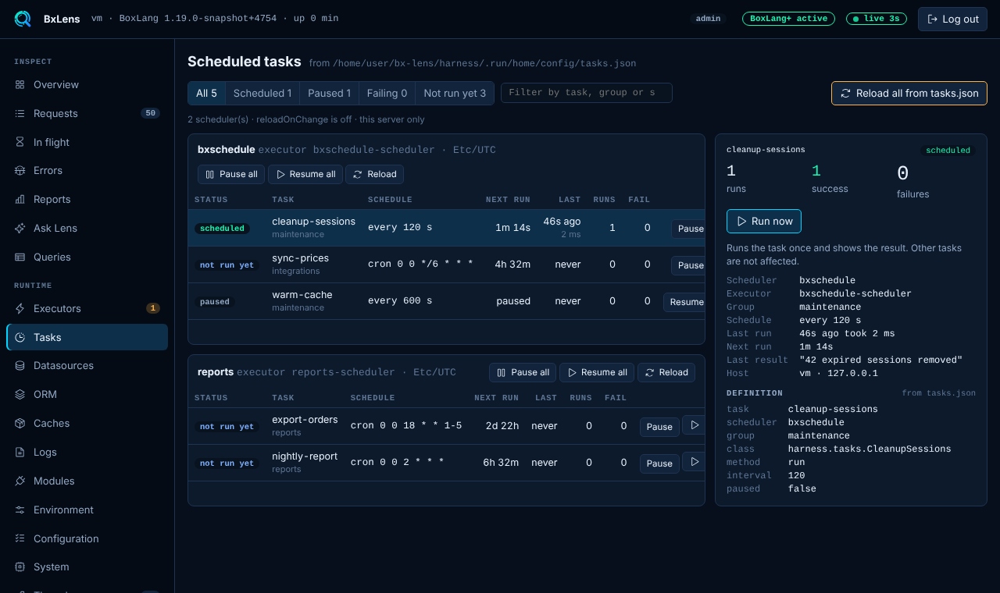

# Tasks

The Tasks page lists the schedulers and scheduled tasks of this server. It reads them from BoxLang's `SchedulerService` and from the definitions in `tasks.json`. Viewing is free. The actions need BoxLang+.

## The list

Tasks are grouped by scheduler. Each scheduler header shows its executor, time zone and whether it has started. Each row shows:

| Column | Meaning |
|---|---|
| Status | One of the statuses below. |
| Task | Name and group. |
| Schedule | `cron ...`, `every N s`, `every N unit`, `daily at ...` or `custom`. |
| Next run | The next fire time. For cron tasks Lens works it out from the expression, because core keeps a polling time instead. |
| Last | When it last ran and how long it took. |
| Runs, Fail | Total runs and total failures. |

Filter by All, Scheduled, Paused, Failing or Not run yet, or search by task, group or scheduler.

### Statuses

| Status | Meaning |
|---|---|
| scheduled | Enabled and waiting for its next run. |
| paused | Disabled. |
| failing | Its last run ended in an error (Lens remembers this since it started). |
| not run yet | Enabled and has never run. |
| error | The scheduler could not schedule it. The scheduling error is shown in the detail. |

There is no "running now" flag, because core does not expose one.

## The detail

Pick a task to see its runs, successes and failures, the scheduler, executor, group, schedule, last run, next run, last result, host and IP. If the last run failed you see the error and a collapsible stack trace. The **Definition** block shows the entry from `tasks.json` with sensitive keys masked. A task registered in code instead of `tasks.json` says so.

## Actions

!!! note "BoxLang+"
    Run now, pause, resume and reload need BoxLang+ or a trial. On Free the page shows a BoxLang+ note, the buttons are disabled and the server answers 403. You still see every task, its history and its definition.

| Action | What it does |
|---|---|
| Run now | Runs the task once. See below. |
| Pause, Resume | Disable or enable one task. Lens tells the scheduler service, as a pause from code does. |
| Pause all, Resume all | The same for every task in one scheduler. |
| Reload | Re-reads `tasks.json` and restarts the scheduler. Asks first, because running tasks finish before the restart. |
| Reload all from tasks.json | Reload for every scheduler. |

Actions are logged with the caller's address. Set `console.actions` to `false` to disable them. The buttons are then greyed out and the server refuses the calls.

### Run now

Run now starts the task once on its own virtual thread and waits up to `console.runTimeoutSeconds` (60). Other tasks are not affected, and the normal schedule goes on.

- If it finishes you see the time it took and the result, or "Finished. The task returned nothing."
- If it throws you see the error and the stack trace, and the task becomes `failing`.
- If it is still running when the wait ends, the console says so and the task keeps going in the background.

## Known limits

- Core keeps run counts but not the error of the last run. Lens remembers outcomes in memory from the moment it starts, so a failure before that is not shown. Reloading a scheduler clears its remembered outcomes.
- For cron tasks, Next run is computed from the cron expression and the scheduler's time zone, not read from core.
- Core has no "running now" flag, so a task that is mid-run still shows as scheduled.
- This page covers this server only. It does not see other nodes.
