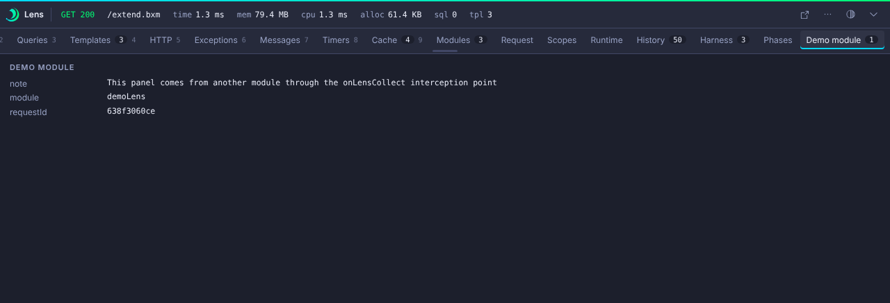

# Extending Lens

Every BoxLang module has its own class loader, so a module cannot implement Java interfaces from inside bx-lens. Lens therefore uses a data-first contract. You declare a panel and fill it with data. Lens renders it with a built-in renderer, so you ship no JavaScript.

This is the only extension tier in v1. Java collectors and custom UI are [planned](../project/roadmap.md).


## Interception points

Lens registers these points. Your code only listens.

| Point | When | Payload |
|---|---|---|
| `onLensRegister` | At Lens activation, and again after all modules activate | `data.registry.panel( id, label, icon, order, renderer )` |
| `onLensRequestStart` | Per request, after the request object exists | `context`, `requestId` |
| `onLensCollect` | Per request, before render | `data.lens.panel( id )` handle to add data, and `data.requestId` |
| `onLensRequestFinish` | Per request, after it is stored | `requestId`, `summary` |

## From a module

Declare the panel once, then fill it for each request. The harness ships a working example in `harness/home/modules/demoLens`.

Register an interceptor in your module:

```javascript title="ModuleConfig.bx"
function configure() {
	settings = {};
	interceptors = [
		{ class : "interceptors.DemoLens", name : "DemoLens@demoLens", properties : {} }
	];
}
```

Then write the interceptor:

```javascript title="interceptors/DemoLens.bx"
class {

	function onLensRegister( data ) {
		data.registry.panel( "demo", "Demo module", "bolt", 110, "kv" );
	}

	function onLensCollect( data ) {
		data.lens.panel( "demo" )
			.kv( {
				module    : "demoLens",
				requestId : data.requestId,
				note      : "This panel comes from another module"
			} )
			.badge( 1, "none" );
	}

}
```



## From app code

You can build a panel without a module. Call `lensPanel` anywhere in a request.

```javascript
lensPanel( "harness", "Harness", "table" )
	.columns( [ "Feature", "Source", "Count" ] )
	.rows( [
		[ "Custom panel", "application code", 1 ],
		[ "Panel from a module", "demoLens module", 1 ]
	] )
	.badge( 2, "none" )
	.order( 95 );
```

See `harness/app/extend.bxm` for the full page.

## Renderers

| Renderer | Builder method | Use it for |
|---|---|---|
| `table` | `columns( [...] )`, `rows( [...] )` | Rows and columns. A row is an array, or a struct keyed by column title. |
| `kv` | `kv( struct )` | Key and value pairs. |
| `tree` | `tree( nodes )` | Nested data. Each node has `label`, optional `ms` and optional `children`. |
| `spans` | `spans( [...] )` | Timed items. These feed the Timeline. |
| `messages` | `messages( [...] )` | Log style lines. Each has `level`, `text` and optional `ms`. |
| `json` | `json( value )` | Raw structured data. |
| `text` | `text( value )` | Plain text. |

### Spans

A `spans` panel supplies a label, a start, a duration and a type for each item. Lens draws them in the [Timeline](../panels/timeline.md) with the `custom` type.

```javascript
lensPanel( "phases", "Phases" )
	.spans( [
		{ label : "warm up", start : 0.5, dur : 1.5, type : "custom" },
		{ label : "render", start : 2.5, dur : 2, type : "custom" }
	] );
```

### Issues

A panel can add issues. They show on the [Issues](../panels/issues.md) tab and drive the strip color.

```javascript
lensPanel( "orm", "ORM" )
	.issue( "warn", "Slow flush", "Flushing Order took 31 ms", "/app/models/Order.bx", 88 );
```

The arguments are `severity, title, detail, file, line`.

## Safety

Module and app data goes through the same redaction, caps and escaping as built-in collectors. The UI always shows text as text. Panels cannot ship HTML or script.
