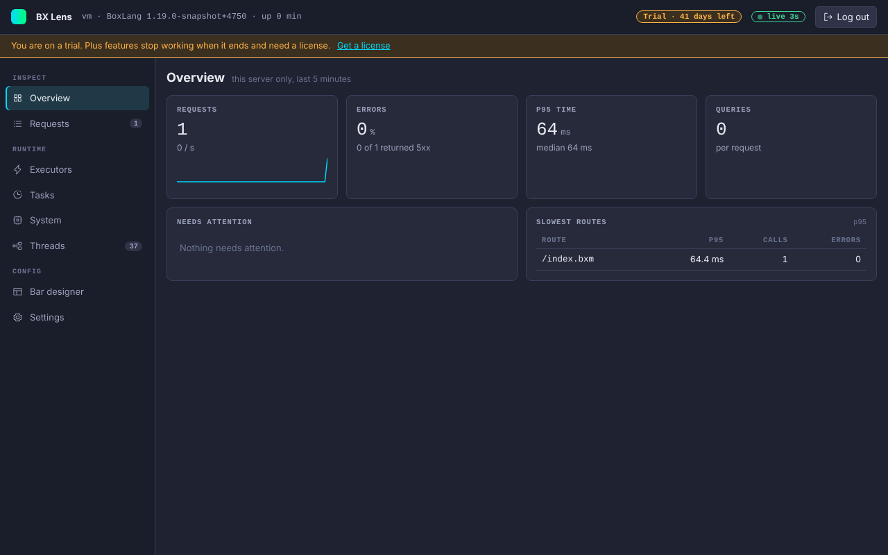

# Licensing

## The license

BX Lens ships under a BoxLang+ proprietary license, in the `LICENSE` file of the module. It is freeware with limits: the free features can be used without a subscription, including in production, but not redistributed or modified. The BoxLang+ features and the removal of the free limits need a BoxLang+ subscription or an active trial. The same terms apply to every Ortus BoxLang+ module, such as bx-redis. The exact text is the `LICENSE` file, not this page.

## Free and BoxLang+

This is the current split. When it changes, this page changes with it. The one list of locked features is `Licensing.PLUS_FEATURES`, and the server checks it in one place (`Licensing.has()`).

On Free, a locked item shows a "BoxLang+" note or chip next to it, and the server answers 403 with a message that names BoxLang+ (AI answers 409). A trial or a valid BoxLang+ license unlocks all of it.

### What Free includes

- The bar and all its tabs, except request cost and the slow request sample. This includes the BIFs timing tab, Copy prompt and the Ask ChatGPT and Ask Claude buttons.
- Console Overview, Requests (the last 25 are kept in memory), In flight, Executors, Scheduled tasks (viewing), Datasources (including Test connection), Caches (statistics and the key list), Logs (browse, search, level filter, live tail), Environment, Modules, System, Threads (including the thread dump), Run GC, Queries (including ORM SQL), Errors (in memory), Reports (in memory, since startup, a 60 minute series), and Ask Lens with a copied prompt.
- Live Settings, read-only mode, the viewer role, the audit log, proxy header trust and `console.requireHttps`.
- The bar designer page, including the Open console button and the More menu.
- All `lens*` BIFs, including `lensReport`, `lensErrors`, `lensQueries`, `lensInflight` and `lensLicense`, and the extension API.

### What needs BoxLang+ or a trial

| Feature | Free | BoxLang+ or trial | Where the lock shows |
|---|---|---|---|
| Request cost (CPU time and allocation) and the slow request sample | Not collected | Collected | Bar: the `cpu` and `alloc` chips are hidden, and the Runtime tab has a BoxLang+ note. |
| Scheduled task actions: Run now, pause, resume, reload | View only | Allowed | Tasks page: a BoxLang+ note, and the action buttons are disabled. Server: 403. |
| Caches: read a value, evict, reap, clear | Statistics and the key list | Allowed | Caches page: a BoxLang+ note, and View, Evict, Reap and Clear are disabled. Server: 403. |
| Download a log file | Browse, search and live tail | Allowed | Logs page: the Download button is disabled with a Plus chip. Server: 403. |
| Diagnostic bundle | No | Allowed | Environment page: the Diagnostic bundle link is disabled with a Plus chip. Server: 403. |
| Heap dump | No | Allowed, and still off until `console.allowHeapDump` is `true` | System page: a BoxLang+ note replaces the heap dump controls. Server: 403. |
| Save or reset a bar layout | Look at the designer | Allowed | Bar designer: Save layout and Reset to default are disabled, with a "BoxLang+ to save a layout" chip. Server: 403. |
| AI calls from the server: Explain with AI, Ask Lens and the [Lensy](console/ai.md) (chat, tools, approved actions) | No | Allowed, with `ai.enabled` | The assistant button and the bar's Ask link are hidden. The AI page and Ask Lens page show a BoxLang+ note and the AI settings are locked. Server: 409 for a chat, 403 for the AI settings and the connection test. |
| Disk store: errors and reports saved, totals since first install, a longer minute series | In memory, 60 minute series | Saved to disk, series as long as `store.retentionHours` | Errors and Reports pages: a note that the data is kept in memory only. |
| ORM statistics (Hibernate totals per session factory) | The ORM SQL is free and shows with other queries | The console ORM page | ORM page: a BoxLang+ note. Server: 403. |
| Requests kept in memory | 25 at most, even if `history.maxRequests` is higher | `history.maxRequests` as configured (default 50) | None. The Requests list and the History tab hold 25. |

The disk store (`store.enabled`, on by default) writes `errors.json` and `reports.json` to `store.dir` (default `lens-data` in the BoxLang home). It keeps data for `store.retentionHours` (72), limits the errors file to `store.maxMB` (50) and writes every `store.flushSeconds` (30). Each file is replaced atomically. See [Errors and Reports](console/errors-and-reports.md#the-disk-store). Without the license the store settings have no effect. The bar layout file and the settings overrides file are small files for your own choices, and the settings file works on Free. Saving the bar layout needs BoxLang+.

If a trial ends or a license expires, the locked features stop at the next license check (the answer is cached for 5 minutes). The disk store stops writing, the request history returns to 25, and request cost, the slow sample and the AI calls stop. The saved files stay on disk. Lens reads them at the next start if the license is valid then. Settings you configured do not have to change.

BoxLang AI (bx-ai) ships inside the module, in its `modules` folder, so there is nothing else to install. It is Apache 2.0 licensed. Using it from Lens still needs `ai.enabled` and, for the server calls, BoxLang+.

## License states

Lens detects the state through the `bx-plus` module, the same way other BoxLang+ modules do. It asks the global `BoxlangLicenseService` whether the license is valid and whether it is a trial (`isValidLicense`, `isTrialMode`), and reads the expiry from `BoxlangLicenseInfo`.

| State | Label in the console | When |
|---|---|---|
| Plus active | `BoxLang+ active` | A valid license that is not a trial. |
| Trial | `Trial` with the days left | A valid trial license. The console shows a banner: you are on a trial, Plus features stop working when it ends and need a license, with a link to [boxlang.io/plans](https://boxlang.io/plans). |
| Expired | `License expired` | The license is present but not valid. The banner says Plus features may stop working. |
| Free | `Free` | `bx-plus` is not installed, or the check failed. |



The state shows in the console header.

## Safe by design

- The answer is cached for 5 minutes.
- A missing, invalid or failing license check never breaks Lens. It reports Free and carries on.
- Lens makes no network call for licensing. It only talks to the `bx-plus` module in the same runtime.

## Show a state for a demo

Set `dev.license` to `trial`, `plus`, `expired` or `none` to force a state. An empty value detects the real one. The harness reads the `LENS_LICENSE` environment variable for this:

```bash
LENS_LICENSE=trial harness/start.sh
```

## Third-party notices

The console and the bar use Alpine.js and Phosphor Icons. Phosphor Icons are MIT licensed, the notice is in `src/main/bx/assets/ICONS-LICENSE.txt`.
