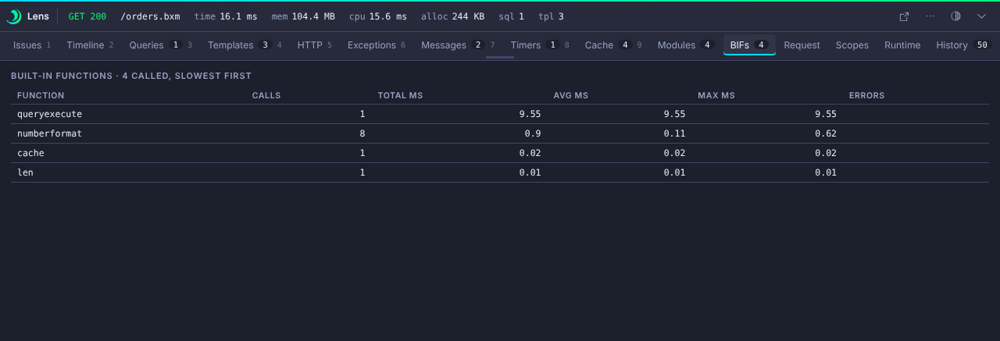

# BIFs

The BIFs panel shows which built-in functions a request called and how long they took. It sums the calls per function name, and sorts the list by total time, slowest first.



| Column | Meaning |
|---|---|
| Function | The BIF name, in lower case. |
| Calls | How many times the request called it. |
| Total ms | All calls added. |
| Avg ms | Total divided by calls. |
| Max ms | The slowest single call. |
| Errors | How many calls threw. Empty when none. |

The tab badge counts the functions in the list. If the collector ran but measured nothing, the tab shows "No built-in function calls were measured."

## Turn it on

The panel is off by default. Turn it on with `collectors.bifs.enabled`:

```json title="boxlang.json"
{
	"modules": {
		"bxLens": {
			"settings": {
				"collectors": { "bifs": { "enabled": true } }
			}
		}
	}
}
```

Restart the runtime. Until then the BIFs tab does not exist.

!!! warning "It costs time on every BIF call"
    Core announces `postBIFInvocation` and `onBIFException` only when something listens. While this collector is on, every BIF call in the runtime allocates an event, for every request, not only the one you look at. Turn it on to hunt a slow function, then turn it off. It is a heavy collector, so `collect.level: "light"` skips it.

## What it needs

It needs a BoxLang snapshot or release where `postBIFInvocation` carries `elapsedNanos` and core announces `onBIFException`. This was merged in BoxLang core pull request 657. On an older core the tab stays empty or does not appear. See [Core Event Inventory](../reference/events.md).

## Limits

- Lens's own functions (every name that starts with `lens`) are left out.
- A request keeps at most 300 function names. Calls to a new name after that are not counted.
- The list shows the top 60 functions by total time.
- The numbers cover the BIF call itself as core reports it. They are not exact to the microsecond.
