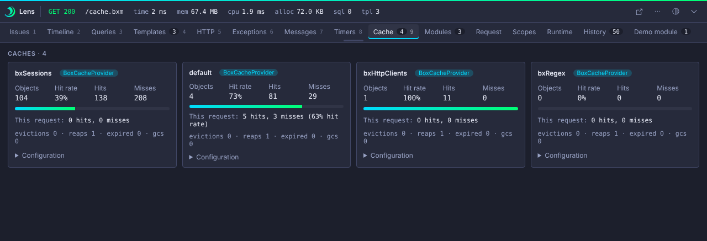

# Cache

The Cache panel shows BoxCache statistics for the request, per cache:

- hits
- misses
- hit rate
- object count

<!-- screenshot: cache.png generated by e2e -->


The panel is off by default. Enable it:

```json title="boxlang.json"
{
	"modules": {
		"bxLens": {
			"settings": {
				"collectors": { "cache": { "enabled": true } }
			}
		}
	}
}
```

!!! note "Core limitation"
    BoxLang core 1.19 announces cache writes (insert, update, remove, clear) but has no read, hit or miss event. The spec lists this as a core gap to request. See [Core events](../reference/events.md#core-gaps).
