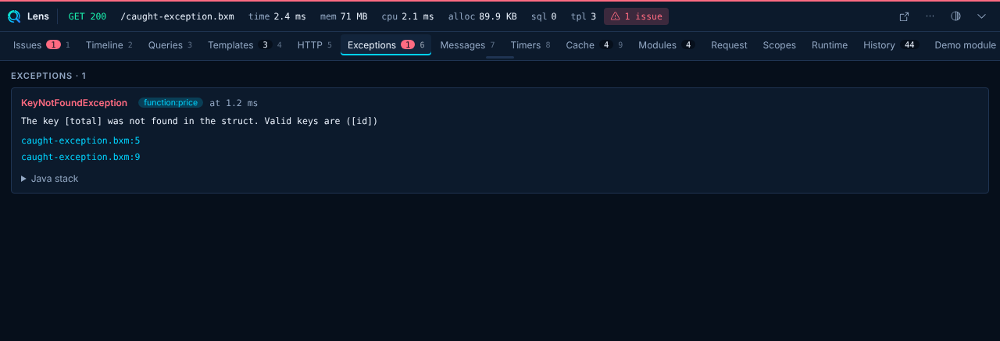
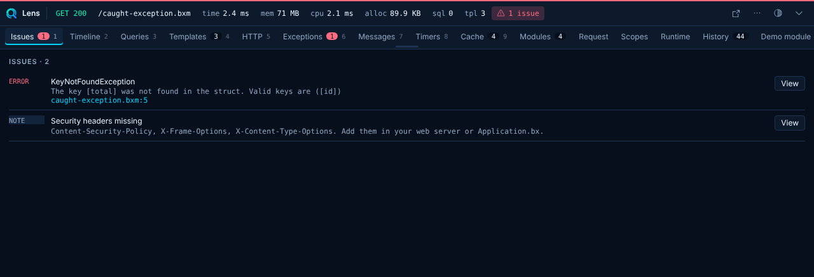

# Exceptions

The Exceptions panel records exceptions that your code caught and reported, and exceptions that pass through functions. Each entry shows the type, message, source location with an editor link, and the Java stack.



To record an exception you caught yourself, call [`lensException`](../guides/bifs.md#lensexception):

```javascript
try {
	riskyCall();
} catch ( any e ) {
	lensException( e );
	// handle the error
}
```

A caught exception is critical, adds an issue and, by default, opens the panel on Issues (`ui.autoOpenOnException`).



## Uncaught errors

When a request ends in an uncaught exception or an abort, core skips `onRequestEnd` and renders its own error page. Lens cannot inject a bar into that page, because the web context does not announce `onRequestFlushBuffer`. Lens still records the request, with its exception, in the console [Requests](../console/index.md) page.

`collectors.exceptions.max` caps the list (default 50).
