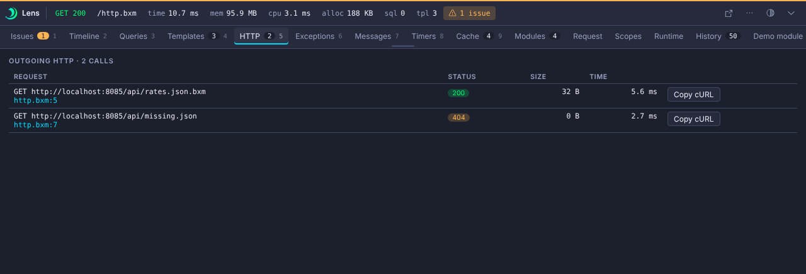

# HTTP

The HTTP panel lists outgoing calls made with `bx:http` during the request. Each row shows the status, size and time.

An outgoing 4xx response warns. A 5xx response or a transport failure is critical. Calls also appear as spans on the [Timeline](timeline.md).

`collectors.http.max` caps the entries (default 100).
