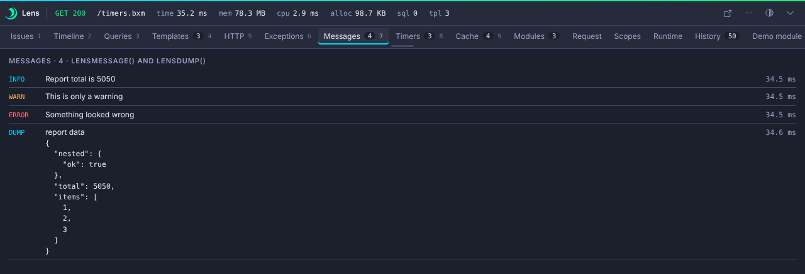
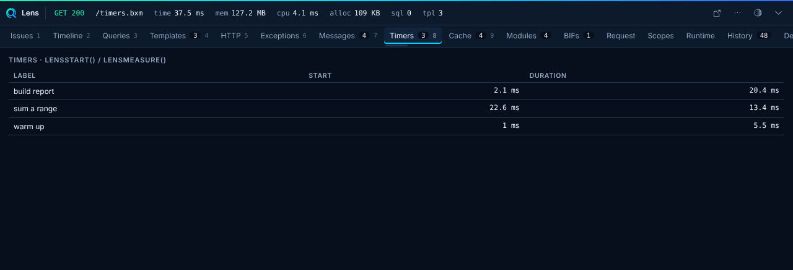

# Messages and Timers

## Messages

Messages shows output from [`lensMessage`](../guides/bifs.md#lensmessage) and [`lensDump`](../guides/bifs.md#lensdump). Dumped values show as a collapsible tree. When you enable `collectors.logs`, log messages appear below the messages.



```javascript
lensMessage( "Cart loaded", "info" );
lensMessage( { items : 3, total : 42.5 }, "debug" );
lensDump( cart, "cart" );
```

`collectors.messages.max` caps the list (default 200). Values pass through redaction and the `limits` caps.

## Timers

Timers shows spans from [`lensStart`](../guides/bifs.md#lensstart), [`lensStop`](../guides/bifs.md#lensstop), [`lensMeasure`](../guides/bifs.md#lensmeasure) and [`lensAddMeasure`](../guides/bifs.md#lensaddmeasure), with their start and duration. They also show on the Timeline.



```javascript
lensStart( "report" );
buildReport();
lensStop( "report" );
```

`collectors.timers.max` caps the list (default 200).
