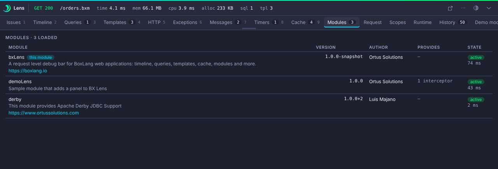

# Modules

The Modules panel lists every loaded module. Each row shows the name, version, author, description, URL, what the module provides (BIFs, components, interceptors) and its state with the activation time.

!!! note
    BIFs that a module registers through the Java service loader may show as none for that module.

The console has a fuller [Modules page](../console/modules.md). The panel is on by default. Turn it off with `collectors.modules.enabled`.
