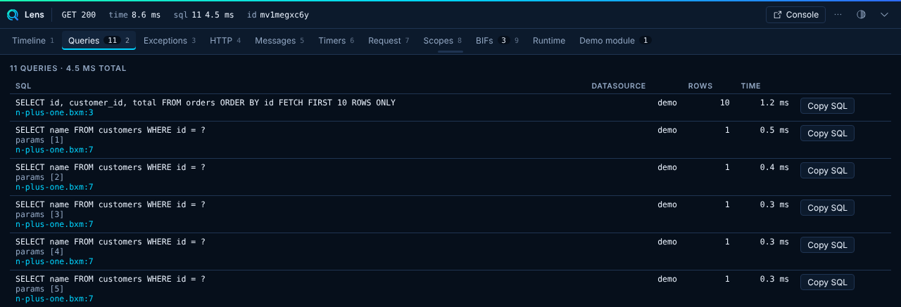

# Queries

The Queries panel lists each SQL statement the request ran, with its datasource, duration, row count and parameters.

<!-- screenshot: queries.png generated by e2e -->


## Detection

::: cards
::: card title="Slow queries" icon="lucide:timer"
A query slower than `thresholds.slowQueryMs` (default 25 ms) raises an issue.
:::
::: card title="Duplicates" icon="lucide:copy"
With `detectDuplicates`, Lens flags identical statements run more than once.
:::
::: card title="N+1" icon="lucide:repeat"
With `detectNPlusOne`, Lens flags the same query shape repeated at least `thresholds.nPlusOneMin` times (default 3).
:::
:::

Flagged queries appear on the [Issues](issues.md) tab, and each issue links back to its row.

## Parameters

`collectors.queries.includeParams` controls whether Lens shows bound parameters. Values pass through [redaction](../security.md#redaction). Use the copy action to copy the SQL with its params.

## Example

This loop triggers the N+1 flag:

```javascript
users = queryExecute( "SELECT id FROM users" );
for ( user in users ) {
	queryExecute(
		"SELECT * FROM orders WHERE user_id = :id",
		{ id : user.id }
	);
}
```

Fix it with one joined query or a single `WHERE user_id IN (...)`.
