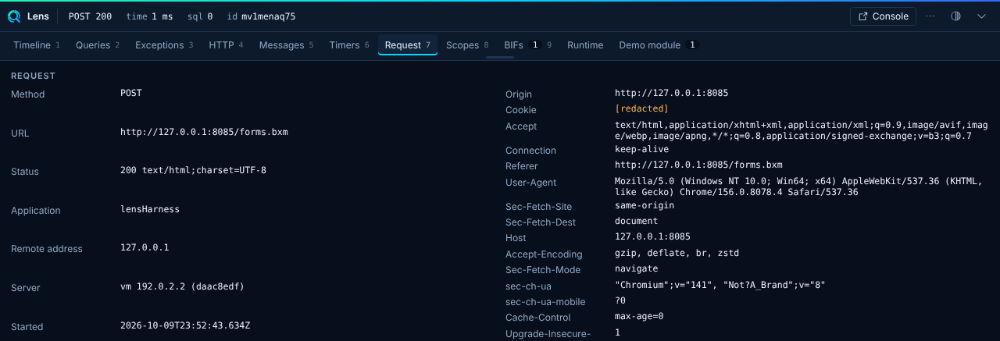
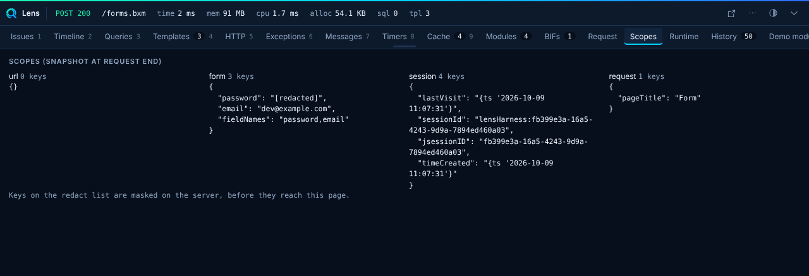

# Request and Scopes

## Request

The Request panel shows the method, URL, status, the server that handled the request (host, address and id), request headers, **response headers** and params of the current request. Copy it as JSON or as a cURL command. Lens masks header and param values whose key matches `redact.keys`. The `Cookie` and `Authorization` headers are masked by default. At `collect.level: "light"` request headers are not collected.

The response headers are what your app sent, so you can check security headers and cookies in place. Missing ones are reported as [Notes](../console/issues.md#security-notes).

## Scopes

The Scopes panel shows scope contents. `url` and `form` are on by default. `cookie`, `session`, `request`, `application` and `variables` are off. Turn them on under `collectors.scopes`.

`limits.maxDepth` (4), `limits.maxItems` (100) and `limits.maxString` (2000) cap what Lens sends.

!!! warning
    Scope dumps can hold secrets. Redaction covers keys that contain an entry from `redact.keys`. Add your own keys before you enable a scope. See [Security](../security.md).
