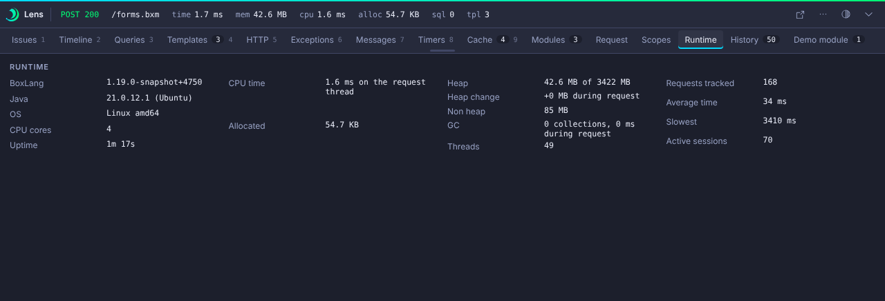

# Runtime

The Runtime panel (collector `jvm`) is a snapshot of the server the request ran on. It is read from the runtime, not collected during the request, and it is rebuilt at most every five seconds, so it costs a request a field read.

| Row | Source |
|---|---|
| BoxLang | version, build date and code name of the runtime |
| Java | `java.version` and `java.vendor` |
| System | operating system name, version and architecture |
| Uptime | JVM uptime |
| Heap | heap used and maximum |
| Server and application | the host name, and the application name of the request |
| Caches | the **names** of the configured caches (no statistics, no configuration) |
| Settings | a short list of main settings taken from the real configuration: debug mode, compiler, time zone, locale, the request, session and application timeouts, session storage and management, the default datasource, the number of mappings, the modules directory, the size of the security allow and deny lists and the experimental flags that are on |

Only keys that exist in the configuration are listed. A value whose name looks secret is hidden by the same matcher as everywhere else in Lens. The console [Configuration](../console/configuration.md) page shows every area with the effective value and where it came from.

## Request cost

!!! note "BoxLang+"
    Request cost (CPU time and bytes allocated by the request thread) needs BoxLang+ or a trial. It is shown in the [Request](request-and-scopes.md#request) panel. On Free that panel says so and Lens does not measure the request.

For JVM-wide numbers and a thread dump (free), use the console [System](../console/system-and-threads.md) and [Threads](../console/system-and-threads.md#threads) pages.
