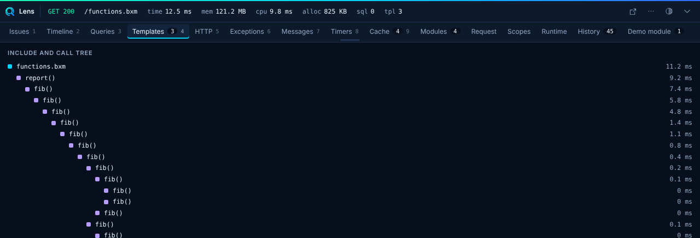

# Templates

The Templates panel shows the tree of templates and includes the request ran, with the time each took. Lens measures template time itself, because core does not report it. It uses self time, which excludes the children.

- Templates and functions with a self time above `thresholds.slowTemplateMs` (default 100 ms) raise an issue.
- The first run of a template includes its compilation time, so it can look slow once.
- `collectors.templates.max` caps the entries (default 300).
- Function calls appear when you enable `collectors.functions`. It is off by default because it is a hot path. Use `minMs` to skip fast calls.
- Rows with a source location open in your editor.

The same entries feed the [Timeline](timeline.md).
