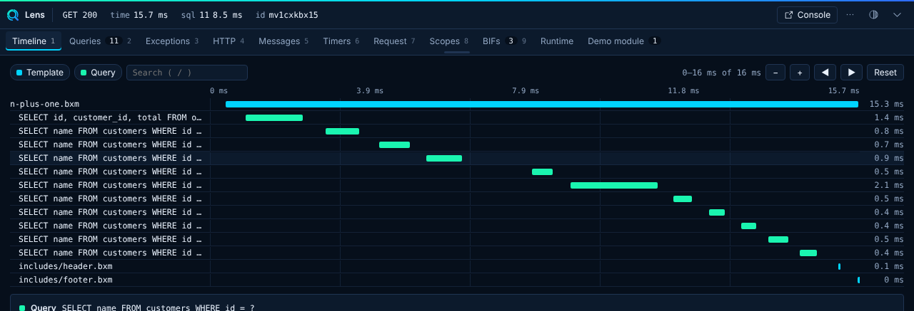

# Timeline

The Timeline is the main view. It draws templates, functions, queries, HTTP calls, transactions, timers and custom spans on one time axis, with nesting that shows who called what.

## What you can do

- Hover a row for details.
- Click a row to open a detail drawer with the full entry and copy actions.
- Filter by type (Template, Function, Query, HTTP, Transaction, Timer, Custom).
- Search by text. Press `/` to focus the search box.
- Open the source file from a row in your editor.

Slow rows carry a flag. Spans from custom panels appear here with the `custom` type. See [Extending Lens](../guides/extending.md#spans).

All times are offsets from the start of the request.

## Settings

Function spans need the opt-in `collectors.functions` collector. Transaction spans come from `collectors.transactions`. See [Configuration](../configuration.md#collectors).
