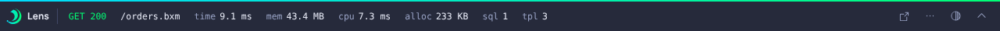
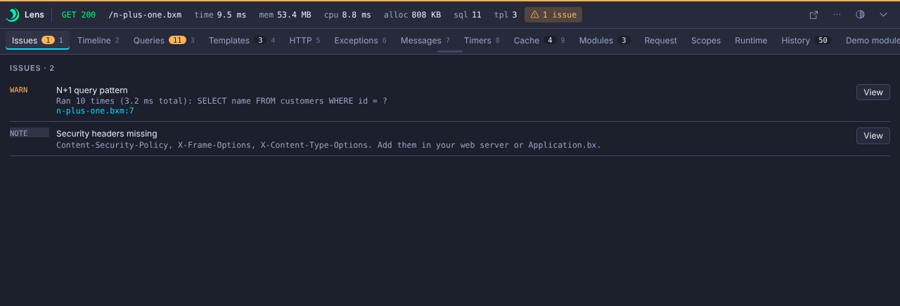
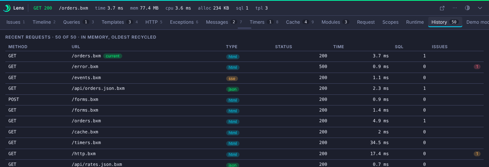
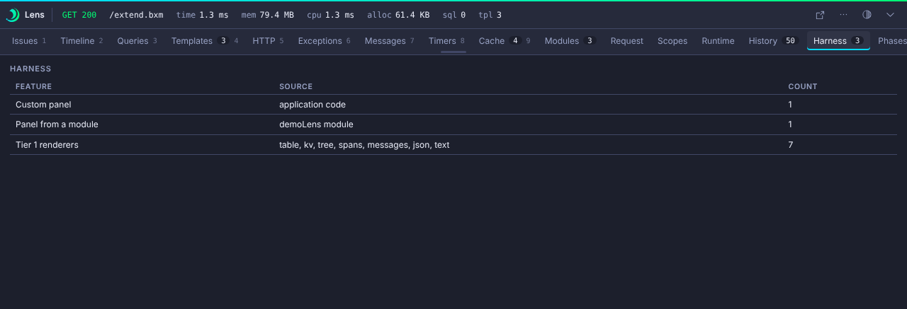
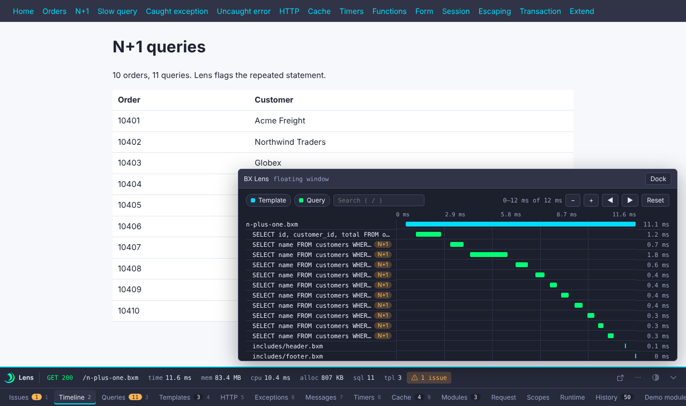
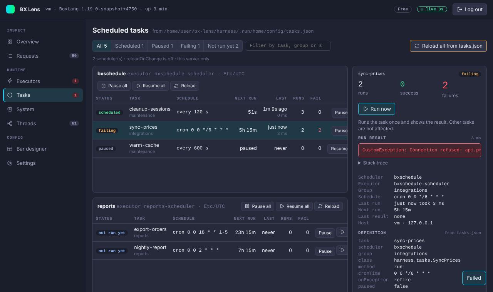
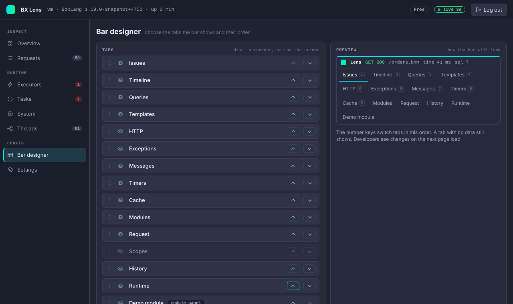

# Demo Script

Use the harness to show Lens in about ten minutes. Start it with `harness/start.sh` and open `http://localhost:8085`. See [Development](contributing.md#the-harness).

## 1. The healthy page

Open `/orders.bxm`. Point at the collapsed strip: status, time, memory, query and template counts.

Press ``Ctrl+` `` to open the panel. Show the Timeline, then press `3` for Queries, and the Timers and Messages tabs.

## 2. An N+1

Open `/n-plus-one.bxm`. The strip turns amber. Open Issues and click the N+1 issue to jump to its row. Show the caller in Queries.

## 3. A slow query

Open `/slow.bxm`. Show the slow query flag in Issues and on the Timeline.

## 4. A caught exception

Open `/caught-exception.bxm`. Lens opens the panel on Issues by itself. Open Exceptions to show the stack and the editor link.

## 5. An uncaught error

Open `/error.bxm`. Core shows its own page, so there is no bar. Go back to `/orders.bxm` and open History to show the request, its exception and its issue.

## 6. History

Visit `/api/orders.json.bxm` and `/events.bxm`, then open History on an HTML page. Show the JSON and SSE rows with their type pills. Mention the 50 request ring buffer and that nothing is saved.

## 7. HTTP and cache

Open `/http.bxm` and show the 404 flagged on HTTP. Open `/cache.bxm`, then the Cache tab, and show the request hits and misses.

## 8. Redaction

Open `/forms.bxm`, submit the form and open Request and Scopes. The password value is masked. Open `/session.bxm` and show the masked token.

## 9. Extend it

Open `/extend.bxm`. Show the Harness and Phases panels built from app code, and the Demo module panel from `demoLens`.

## 10. The UI

Drag the top edge to resize, press the detach button to float the panel, then dock it again. Toggle the theme. Reload the page and show that the state persists.

## 11. The console

Open `http://localhost:8085/~bxlens/index.bxm` and sign in with `lens-demo`. Start on Overview, then open Requests and pick the N+1 request you made earlier. Click Open console in the bar and the More menu to show the link from a page to its request.

## 12. Executors and tasks

Open `/load.bxm`, then the Executors page. The `demo-pool` goes degraded and then critical as eight tasks queue on two threads. Open Tasks, pick `sync-prices`, press Run now and show the error. Pause and resume `cleanup-sessions`.

## 13. A slow request

Open `/stall.bxm`, then Issues. The Slow request issue names the line where the request was after 3 seconds. Point at the `cpu` and `alloc` chips in the strip.

## 14. Design the bar

Open the Bar designer, hide a tab, move another, save, and reload a page. Press Reset to default.

