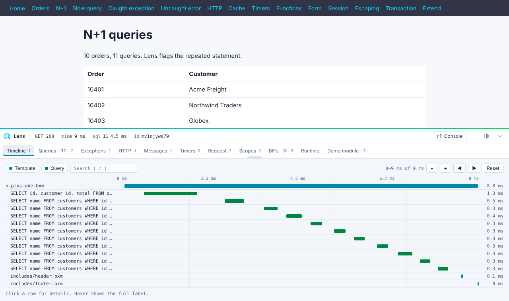

# Keyboard and UI

## Health strip

The bar starts as a collapsed strip with status, request time, memory, query count and template count. The strip border and an issues chip turn amber or red when a request is slow, has an N+1, catches an exception, or returns a 4xx or 5xx status.

When an exception is caught or thrown, Lens opens the relevant tab for you. Turn this off with `ui.autoOpenOnException`.

## Shortcuts

| Key | Action |
|---|---|
| ``Ctrl+` `` | Toggle the panel. Change it with `ui.hotkey`. |
| `1` to `9` | Switch to the tab in that position. |
| `/` | Focus the search box. |

## Layout

- The panel docks at the bottom of the page.
- Drag the top edge to resize it.
- Use the pop-out button to detach the panel into its own window. Disable this with `ui.allowDetach`.

<!-- screenshot: popout.png generated by e2e -->

Lens remembers the open tab, the height and the collapsed state per browser.

## Themes

Lens has a light and a dark theme. `ui.theme` accepts `auto`, `light` or `dark`. `auto` follows your system.

<!-- screenshot: light-theme.png generated by e2e -->

## Search and filters

Panels support text search. The Timeline also filters by type: template, function, query and HTTP, plus any span type that a panel contributes.

## Copy actions

Copy SQL with its params, a `file:line` reference, the request as JSON, or a cURL command. Open any row in your editor with the `editor` settings. See [Configuration](configuration.md#editor).
