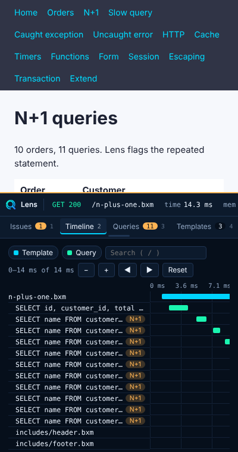

# Keyboard and UI

This page covers the bar. The console has its own pages, see [Console](console/index.md).

## Health strip

The bar starts as a collapsed strip with the status, the request time, the number of queries and the time they took, the number of exceptions, the request id and a **Console** button.

The strip border turns red for a 5xx response or an exception nothing caught. It has no other color: the bar says what happened, it does not judge. The issues (slow, N+1, security notes) are in the console. Click a chip to open the matching tab. The request id chip copies the id, and the **Console** button opens this request in the console.

When an exception was thrown, Lens opens the panel on Exceptions for you. Turn this off with `ui.autoOpenOnException`.

## Shortcuts

| Key | Action |
|---|---|
| ``Ctrl+` `` | Toggle the panel. Change it with `ui.hotkey`. |
| `1` to `9` | Switch to the tab in that position. |
| `/` | Focus the Timeline search. |

## Console button and More menu

When the console is on and you may use it, the strip has a **Console** button that opens this request in the console. The **More** menu next to it has:

- Copy request as JSON
- Copy request id
- Detach as a floating window (or dock it again)

The tabs the bar shows, and their order, can be designed in the console. See [Bar designer](console/bar-designer.md).

## Layout

- The panel docks at the bottom of the page.
- Drag the top edge to resize it.
- The detach button turns the panel into a floating window inside the page. The Dock button puts it back. Disable this with `ui.allowDetach`. It is not a separate browser window.

Lens saves the open tab, height, collapsed state, theme and detached state in the browser's `localStorage`. The tab list comes from the layout saved in the console.

## Themes

Lens has a light and a dark theme. `ui.theme` accepts `auto`, `light` or `dark`. `auto` follows your system. You can also toggle the theme in the bar.

## Small screens

The bar works at phone width without horizontal page scroll.

## Search and filters

The Timeline filters by type (template, function, query, HTTP, transaction, timer and custom) and has a text search.

## Copy and editor links

Copy actions cover SQL (with its params in the Queries tab), a `file:line` reference, the request as JSON and a cURL command. Rows with a source location open in your editor. Set `editor.linkPattern`, and use `editor.remoteBase` and `editor.localBase` to map container paths. See [Configuration](configuration.md#editor).
