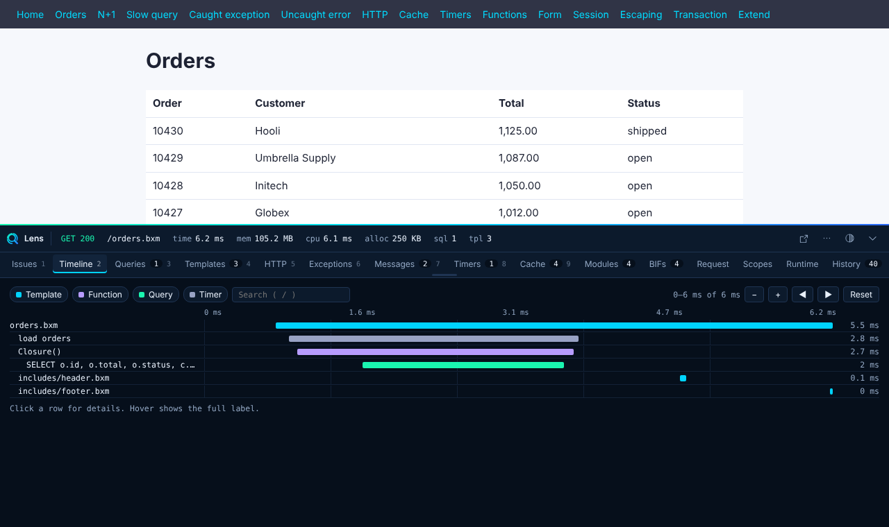

<p align="center"></p>

# ⚡︎ BoxLang Module: BX Lens

```
|:------------------------------------------------------:|
| ⚡︎ B o x L a n g ⚡︎
| Dynamic : Modular : Productive
|:------------------------------------------------------:|
```

<blockquote>
	Copyright Since 2023 by Ortus Solutions, Corp
	<br>
	<a href="https://www.boxlang.io">www.boxlang.io</a> |
	<a href="https://www.ortussolutions.com">www.ortussolutions.com</a>
</blockquote>

<p>&nbsp;</p>

A debug bar and a console for BoxLang web applications. The **bar** gives every HTML page a strip at the bottom with the request timeline, queries, templates, exceptions, HTTP calls, cache, modules, scopes, cost and more. The **console** is a password-protected page for one server with live requests, errors, query statistics, datasources, caches, logs, executor health, scheduled tasks, JVM numbers, threads and a bar designer. Everything is collected by Java code in memory. Lens writes to disk only the bar layout you save, the settings you change in the console, the audit log, and, with BoxLang+ or a trial, saved errors and reports. Items marked **BoxLang+** need a BoxLang+ license or trial, see [Licensing](docs/licensing.md).



Lens works with the BoxLang MiniServer, CommandBox and servlet deployments, because it hooks the request lifecycle that web support already provides.

## Install

```bash
# OS binary
install-bx-module bx-lens

# CommandBox
box install bx-lens
```

Lens is **off by default**. The bar and the console are switched on separately in `boxlang.json`, and each has its own access rule that defaults to loopback only:

```json
{
	"modules": {
		"bxLens": {
			"settings": {
				"bar": { "enabled": true },
				"console": { "enabled": true, "password": "bxsecret:..." }
			}
		}
	}
}
```

Make the password with `boxlang generatesecret "your password"`. The console is at `/~bxlens/index.bxm` (`/~bxlens/` with a trailing slash needs a MiniServer pass predicate, see [production](docs/guides/production.md#the-console-url)). Keep the bar off on live servers and read [Running Lens in production](docs/guides/production.md) before you expose the console. See [Security](docs/security.md).

Upgrading? `enabled` is now `bar.enabled` and `access.allowedIPs` is now `bar.access`. See [Configuration](docs/configuration.md#moving-from-older-settings).

## What you get

| Panel | Shows |
|---|---|
| **Issues** | Everything suspicious, ranked: exceptions, N+1 queries, slow queries, slow templates, failed HTTP calls |
| **Timeline** | One waterfall of templates, functions, queries, HTTP calls and transactions. Hover, click for detail, zoom, pan, filter, search, open the file in your editor |
| **Queries** | Every statement with its parameters, rows, time, datasource and the template line that ran it. Copy SQL |
| **Templates** | The include and call tree |
| **HTTP** | Outgoing HTTP calls with status, size and time |
| **Exceptions** | Caught and uncaught exceptions with BoxLang locations and the Java stack |
| **Messages and Timers** | What your code sends with `lensMessage()`, `lensDump()`, `lensMeasure()` |
| **Cache** | Every BoxCache cache with hit rate, objects, evictions and what this request did to it |
| **Modules** | Loaded modules with version, author, what they provide and activation time |
| **BIFs** | Opt-in (`collectors.bifs.enabled`). Calls, total, average and slowest time per built-in function, and errors. It costs time on every BIF call, so use it to hunt, then turn it off. Needs a BoxLang build with `postBIFInvocation` timing |
| **Request, Scopes, Runtime** | Request and response headers, redacted scope snapshots, memory, GC, threads and versions. **BoxLang+:** the CPU time and allocation of the request |
| **History** | The last 50 requests, including JSON and SSE, recycled in memory. Free keeps the last 25, **BoxLang+** keeps the configured size |
| Your panels | Applications and other modules add panels with `lensPanel()` or the `onLensCollect` interception point |

The Issues tab lists security Notes for missing headers and cookie flags. With **BoxLang+** it also names where a slow request was stuck (a stack sample after `thresholds.slowRequestMs`).

The console pages are Overview, Requests, In flight, Errors, Reports, Ask Lens, Queries, Executors, Tasks, Datasources, Caches, Logs, Modules, Environment, System, Threads, Bar designer and Settings. The console makes no request to any other site, so it works air gapped. See [Console](docs/console/index.md).

## What the console adds

| Feature | What it does |
|---|---|
| **Live settings** | An admin edits settings on the Settings page. Changes apply at once, are saved and survive restarts. `console.readOnly` turns editing off. |
| **Roles** | `console.viewerPassword` gives a view-only role that cannot change anything or download dumps, logs or the bundle. |
| **Proxy and HTTPS** | The client address comes from a proxy header only from a trusted peer. `console.requireHttps` refuses plain HTTP. |
| **Audit log** | Logins, denied attempts and every change go to `bxlens-audit.log`. |
| **Datasources** | Hikari pool numbers, timings and a connection test. |
| **Tasks** | Schedulers and tasks with status and history. **BoxLang+:** Run now, pause, resume and reload. |
| **Bar designer** | Choose and order the bar tabs. **BoxLang+:** save or reset the layout. |
| **Caches** | Statistics and a key list capped at 100. **BoxLang+:** a value view cut at 2 KB, evict, reap and clear. |
| **Logs** | Every log file with search, a level filter and a live tail. **BoxLang+:** an admin download. |
| **Environment** | Configuration, modules, JVM arguments, variables and properties with secrets hidden. **BoxLang+:** a diagnostic bundle zip. |
| **In flight and Queries** | Running requests with a live stack, and runs, average, maximum, total, failures and slow runs per SQL statement. |
| **Errors and Reports** | Errors grouped by cause with redacted samples, and totals, p50, p95 and p99, status classes, URLs and a minute series (60 minutes). **BoxLang+:** saved to disk, with totals since first install and a longer series. |
| **System** | Run GC and a deadlock banner. **BoxLang+:** a heap dump (also off by default, admin only). |
| **AI help** | Optional. Copy a redacted prompt, open ChatGPT or Claude, or, with **BoxLang+**, let the server call a model through `bx-ai` (it ships inside the module). A local provider such as Ollama keeps the data inside your network. |

Free keeps the bar and most of the console, the last 25 requests, and errors and reports in memory. BoxLang+ or a trial adds request cost and the slow request sample, task actions, cache value, evict, reap and clear, log download, the diagnostic bundle, heap dumps, saving a bar layout, AI calls from the server, the disk store and a request history longer than 25. A locked item shows a "BoxLang+" note. This split is the current state and may change. See [Licensing](docs/licensing.md).

A collapsed health strip turns amber or red when something is wrong and opens on Issues when an exception was caught. Resize it, detach it as a floating window, switch themes, and use the keyboard: <kbd>Ctrl</kbd>+<kbd>`</kbd> toggles, <kbd>1</kbd> to <kbd>9</kbd> switch tabs, <kbd>/</kbd> searches.

## Send things to the bar

```javascript
lensMessage( "Loaded #orders.len()# orders", "info" );
lensDump( order, "order after pricing" );

id = lensStart( "price calculation" );
// ...
lensStop( id );

orders = lensMeasure( "load orders", () => orderService.list() );

try {
	risky();
} catch ( any e ) {
	lensException( e );
}

lensPanel( "orm", "ORM" ).columns( [ "Entity", "ms" ] ).rows( rows ).badge( rows.len(), "none" );
```

## Read the console data from code

Five functions return plain structs and arrays and work in any request: `lensReport()`, `lensErrors( limit )`, `lensQueries( limit, sort )`, `lensInflight()` and `lensLicense()`. See the [BIF reference](docs/guides/bifs.md#data-functions).

```javascript
writeOutput( jsonSerialize( { report : lensReport(), slowQueries : lensQueries( 5, "total" ) } ) );
```

## Documentation

The full documentation is built with [bx-sites](https://github.com/ortus-boxlang/bx-sites) from the `docs/` folder: configuration reference, every panel, the BIFs, extending Lens from your own module, security, the core event inventory, and troubleshooting.

```bash
bxSites serve
```

## Try it: the demo harness

`harness/` is a small shop app with a Derby in-memory database that produces every kind of data Lens can show: a healthy page, an N+1 loop, a slow query, caught and uncaught errors, outgoing HTTP, cache hits and misses, JSON and SSE endpoints, a form with a password, a session, transactions and custom panels.

```bash
./harness/start.sh          # builds the module and starts MiniServer on http://localhost:8085
DEV=1 SKIP_BUILD=1 ./harness/start.sh   # serve the UI files from src/main/bx/assets, edit and refresh
LENS_LICENSE=trial ./harness/start.sh   # show a license state (trial, plus, expired, none)
```

The console is at `http://localhost:8085/~bxlens/index.bxm` and the demo password is `lens-demo`. `/load.bxm` saturates a small executor and `/stall.bxm` shows the slow request sample. `harness/home/config/tasks.json` defines the demo scheduled tasks.

## Development

```bash
./gradlew downloadBoxLang          # BoxLang and web support jars, once
./gradlew shadowJar test           # build the module and run the Java tests
./gradlew spotlessApply            # Ortus Java formatting, run before every commit

cd e2e
npm ci
npx playwright install chromium
npm run e2e                        # starts the harness and drives every feature in a browser
npx playwright test screens.spec.ts   # regenerates docs/assets/screenshots
```

Set `LENS_CHROMIUM` to use a Chromium you already have. CI runs the Java tests on Linux and Windows and the Playwright suite on Linux, and uploads the report and the screenshots.

How it fits together:

- `src/main/java/.../LensService` owns the settings, the collectors, the in-memory history, the injector and the slow request watchdog.
- `ConsoleRouter`, `ConsoleAuth` and `ConsoleData` are the console: routes and security headers, login, roles and sessions, and the data for executors, tasks, system and threads. `DatasourceData`, `CacheData`, `LogData`, `EnvironmentData`, `QueryStats`, `ErrorStore` and `Reports` feed the other pages. `SettingsRegistry` and `SettingsStore` are the live settings. `AccessGuard` and `ClientIp` check callers for the bar and the console. `Audit` writes the audit log. `HeapDumper` takes heap dumps. `AiService` and `AiPrompts` are the optional AI help. `Licensing` detects BoxLang+. `LayoutStore` keeps the bar layout.
- `interceptors/collectors/*` are the Java collectors, one per panel. They run as BoxLang interceptors.
- `model/` holds the per request data, the issue engine and the snapshot that the UI reads.
- `src/main/bx/assets/` is the UI for the bar (`lens.*`) and the console (`console.*`): Alpine.js, vendored Phosphor icons, CSS and templates. The bar's data travels as JSON inside the page.
- `src/main/bx/ModuleConfig.bx` declares every setting with its default.

Lens works on one server. BX Insights is the separate observability product for clusters, history over time and alerting.

## License

BX Lens is a product of Ortus Solutions. License terms apply, see the [BoxLang+ plans page](https://boxlang.io/plans) and [Licensing](docs/licensing.md). BoxLang+ or a trial unlocks the items marked BoxLang+ above. This may change. Phosphor Icons are MIT licensed, see `src/main/bx/assets/ICONS-LICENSE.txt`.

## Ortus Sponsors

BoxLang is a professional open-source project and it is completely funded by the [community](https://patreon.com/ortussolutions) and [Ortus Solutions, Corp](https://www.ortussolutions.com). Ortus Patreons get many benefits like a cfcasts account, a FORGEBOX Pro account and so much more. If you are interested in becoming a sponsor, please visit our patronage page: [https://patreon.com/ortussolutions](https://patreon.com/ortussolutions)

### THE DAILY BREAD

> "I am the way, and the truth, and the life; no one comes to the Father, but by me (JESUS)" Jn 14:1-12
